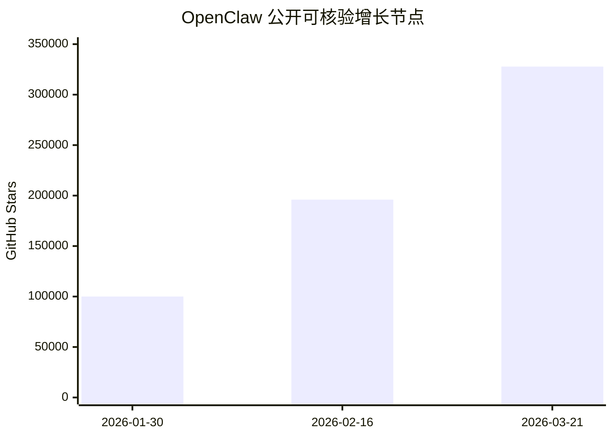
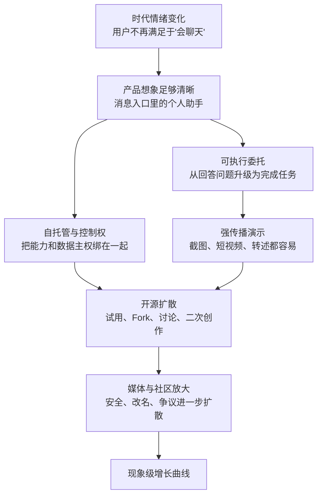

> **学习目标**：理解 OpenClaw 爆发背后的产品、传播与时代因素，而不是只记住一个“10 万 Star”的数字
> **预计时长**：20 分钟
> **难度**：入门

---

## 先说结论：OpenClaw 爆火，不只是因为“它很强”

很多人第一次看到 OpenClaw，会把它的爆发解释成一句很简单的话：

> 因为它做出了一个很强的 AI Agent。

这句话不算错，但太浅了。

真正推动 OpenClaw 在 2026 年初突然破圈的，不只是“能力强”，而是四件事同时成立了：

1. 它提供了一个普通人一眼就能理解的产品想象。
2. 它把 Agent 放进了用户已经每天在用的入口，而不是要求用户再学一个新界面。
3. 它把“本地可控、自己部署、自己掌握数据”这个情绪，和 Agent 需求绑在了一起。
4. 它踩中了一个时代切口：大家已经厌倦只会聊天的 AI，开始想要“能替我做事”的 AI。

所以 OpenClaw 现象真正值得学的，不是“怎么做出一个 viral repo”，而是：

> 为什么一个项目一旦把“入口、控制权、执行能力、分享传播”四件事接到一起，就会形成远超普通开源项目的爆发力。

这也是我们把它放在 MiniClaw 第 1 章第 1 节的原因。

因为后面整门课，其实都在回答同一个问题：

> 如果我们不满足于做一个会对话的模型客户端，而是想做一个真正能工作的 Agent 系统，它最小需要哪些结构？

---

## 先把事实讲清楚：哪些数据是能核验的，哪些是社区传播口径

先做一个很重要的区分。

社区里经常流传一句话：

> OpenClaw 2 天获得了 10 万+ GitHub Star。

但如果我们只看当前能直接交叉验证的公开信息，这个说法应该谨慎使用。

我能直接核验到的公开事实有这些：

- 2026 年 1 月 30 日，Forbes 报道 OpenClaw 已经“超过 100,000 GitHub stars”。
- 2026 年 2 月 26 日，Forbes 另一篇文章提到它在 72 小时内累计超过 60,000 Star。
- 2026 年 2 月 16 日，Forbes 报道它达到 196,000 Star。
- 2026 年 3 月 21 日，我直接查看 GitHub 页面时，仓库显示为 `327,759` Star。

这意味着什么？

这意味着“极短时间内破 10 万”这件事本身是成立的，但“精确到 48 小时 10 万+”更像社区传播口径，而不是我现在能完整一手核死的统计结论。

这类差异在热点项目里很常见。
因为媒体、社区、截图、转发，常常会混用：

- 发布前预热数据
- 改名前后的 Star 统计
- 不同时间截面的截图
- “72 小时 6 万+”和“几天后 10 万+”这样的口径

所以在工程语境里，更严谨的说法应该是：

> OpenClaw 在 2026 年 1 月底到 2 月上旬，以异常陡峭的速度完成了从爆红到破圈，随后继续滚雪球式增长。

下面这个图，不是逐日完整曲线，而是基于公开可核验里程碑做的“增长节点图”：

你应该从这个图里看到的，不是某个精确数字，而是曲线形状：

> 它不是线性增长，而是典型的“社交传播驱动型技术项目”增长曲线。

---

## 第一层原因：OpenClaw 不是“另一个 AI 应用”，而是“把 AI 放回你原本就在用的入口”

这是 OpenClaw 最核心的一击。

过去几年，大多数 AI 产品默认都在训练用户接受一个前提：

> 想用 AI，就打开一个新的聊天窗口。

无论是网页、桌面端、IDE 插件，还是独立 App，本质上都还是这个逻辑。

但 OpenClaw 给出的想象完全不一样。

它在官方文档和 GitHub 首页里反复强调的是：

- 你可以继续在 WhatsApp、Telegram、Slack、Discord、iMessage 这些现有通道里和它交互
- 它不是“另一个聊天软件”
- Gateway 只是控制平面，真正的产品是那个“你每天都能叫到的助手”

这件事为什么重要？

因为它直接改写了用户心智。

传统 AI 的心智是：

> 我去找 AI。

OpenClaw 的心智是：

> AI 来到我已经在用的工作流里。

这两个心智的传播效率完全不一样。

“我去某个网站问问题”，是工具升级。

“我在微信式入口里就能让 AI 干活”，是行为方式升级。

一旦产品叙事从“更聪明的聊天窗口”变成“进入现有通信入口的个人助手”，用户脑中能联想到的场景会瞬间暴涨：

- 在 Telegram 上发一句话，让它查资料
- 在 Slack 里让它读文档、发摘要、做跟进
- 在手机上直接语音触发任务
- 在熟悉的消息流里接收结果，而不是回到某个单独 App 查进度

这就是 OpenClaw 的第一个爆点：

> 它不是在卖模型，而是在卖“入口革命”。

---

## 第二层原因：它把“对话”升级成了“可执行的委托”

如果一个系统只能回答问题，它再强，也容易被用户归类为“高级搜索”或者“聊天工具”。

OpenClaw 吸引人的地方，在于它不把一条消息理解成“提问”，而是更像“委托”。

比如同样一句自然语言：

- 对聊天机器人来说，这是一个要生成回答的输入。
- 对 Agent 来说，这是一个可能触发多步执行链的任务入口。

这会带来一个非常关键的变化：

用户对它的预期不再是“说得像不像人”，而是“能不能把事做掉”。

而一旦产品开始承诺“做事”，Star 的含义也会变化。

很多项目的 Star，本质上是“我觉得这很酷”。

但 OpenClaw 的 Star，里面混入了大量这样的情绪：

- 我终于看到了一个像“个人数字员工”的东西
- 这不是概念演示，而是我可能真的想装起来试试
- 这东西一旦跑通，我的工作方式会变化

这也是为什么它带来的不是普通开源项目常见的“技术讨论热度”，而是一种更接近产品级的扩散。

换句话说：

> OpenClaw 爆发，不是因为它把聊天做到了 120 分，而是因为它把“聊天”变成了“任务入口”。

这恰好也是 Agent 与传统 LLM 应用最重要的分水岭。

---

## 第三层原因：它同时满足了“强能力想象”和“数据控制焦虑”

如果 OpenClaw 只是一个云端 Agent 服务，它未必会形成今天这样的开源传播强度。

它真正击中人心的地方，是把两个原本经常冲突的需求绑在了一起：

- 我想要一个能替我行动的 AI
- 我又不想把所有私人数据和操作权彻底交给别人

OpenClaw 官方定位反复强调：

- personal AI assistant
- run on your own devices
- self-hosted gateway
- local / pairing / allowlist / token auth 这类安全边界

这组叙事非常强，因为它恰好命中了 2026 年用户对 AI 的典型矛盾心态：

一方面，大家越来越想要更强的 Agent。

另一方面，大家也越来越清楚，一旦 AI 能访问：

- 私聊入口
- 文件系统
- 浏览器
- 日历
- 通讯录
- Shell

那么它带来的风险，已经不是“回答错了一个问题”，而是“可能真的替你做错一件事，或者把敏感数据暴露出去”。

所以 OpenClaw 爆火，并不是因为用户忽略了风险。

恰恰相反，很多人正是因为意识到了风险，才会被“自己部署、自己掌控、自己配置安全边界”这个方案吸引。

这里要注意一个判断：

> 自托管并不自动等于安全。

OpenClaw 官方安全文档本身也在强调 pairing、allowlist、token、trusted proxy、日志与凭证暴露等问题。

但从传播角度看，自托管带来的不是“绝对安全”，而是“控制权回到用户自己手里”的心理确定性。

而在 Agent 时代，这种控制权本身就是产品卖点。

---

## 第四层原因：它的传播结构天然适合社交媒体时代

不是所有强产品都能爆成现象级项目。

OpenClaw 还有一个非常重要的优势：

它特别容易被演示，也特别容易被转发。

你想想看，下面哪类演示更容易在社交媒体上传播？

第一类：
“我们做了一个新的 Agent 框架，支持任务编排、工具注册、上下文管理和状态机。”

第二类：
“我在 Telegram 里给 AI 发了一句话，它帮我完成了这件事。”

显然是第二类。

因为它满足了现代传播里最重要的三件事：

1. 一眼能懂
2. 截图就能传
3. 能让观众立刻代入自己的生活或工作

这类产品天然具有“短视频友好”“截图友好”“转述友好”的优势。

而且 OpenClaw 的演示不是抽象 benchmark，而是具体场景：

- 在聊天入口里下命令
- 在真实工具上执行
- 在熟悉的消息流里回结果

这类演示最容易激发一种强传播情绪：

> 原来 AI 还可以这样用。

当大量用户同时产生这种感受时，项目就会从“技术圈热点”升级成“跨圈层现象”。

---

## 第五层原因：它踩中了 2026 年的时代情绪切口

如果把时间拨回 2023 年，OpenClaw 也许未必会引爆同样规模的关注。

因为当时大家对 AI 的主情绪，还是“模型终于能说像人话了”。

但到了 2026 年初，市场情绪已经变了。

用户对纯对话式 AI 的新鲜感正在下降，新的问题变成：

- 它能不能替我执行
- 它能不能进入我的工作流
- 它能不能持续运行，而不是一次性回答
- 它能不能在现实系统里产生结果

这就是为什么 OpenClaw 并不只是一个项目爆红，而更像一个时代信号。

它说明一件事：

> 市场开始把 AI 的价值评价标准，从“会不会说”切换到“能不能做成事”。

一旦评价标准变了，用户关注点也会跟着变：

- 入口位置比聊天体验更重要
- 权限系统比单轮回答更重要
- 会话与执行状态比 Prompt 花活更重要
- 安全边界和治理能力不再是附属问题，而是主问题

这也是为什么后面的 MiniClaw 课程，不会把重点放在“如何调一个最聪明的模型”，而会放在：

- 会话
- 网关
- 事件流
- 状态机
- Lane 并发控制
- 工具执行边界

因为这才是 Agent 系统真正开始和普通聊天应用分道扬镳的地方。

---

## 第六层原因：争议、改名、安全讨论，反而放大了传播

一个现象级项目在爆发期，几乎不可能只有正面传播。

OpenClaw 也一样。

从公开报道看，它在爆发过程中伴随了多种额外放大器：

- 快速改名带来的关注
- 安全研究者对暴露面、权限和攻击面的讨论
- 假仓库、假代币、仿冒站点等蹭热度行为
- 媒体把它当成“Agent 时代样本”来反复报道

这类争议当然会带来风险，但也会客观放大认知扩散。

因为当一个项目同时满足下面两点时，它的传播速度通常会进一步加快：

- 它提供了强烈的正向想象
- 它也暴露了强烈的不确定性和风险

人们会因为“想要它”而讨论它，也会因为“担心它”而讨论它。

讨论一旦跨出开发者圈，就会形成更大的外部流量回流。

所以 OpenClaw 的增长，不只是产品增长，也是议题增长。

它同时踩中了：

- Agent 想象
- 开源热情
- 数据主权
- 自动化焦虑
- 安全恐惧

而这五种情绪叠加在一起时，传播通常不会小。

---

## 把现象压缩成一张图：OpenClaw 为什么会爆

如果你前面读完以后，脑子里信息很多但还没形成结构，可以先记住下面这张图。

这张图的重点不是背下来，而是理解一个原则：

> 现象级 Agent 项目，不是单点能力的胜利，而是“产品想象 + 控制权叙事 + 可传播演示 + 时代情绪”的合成结果。

---

## 这对 MiniClaw 有什么启发？

看到这里，最重要的问题不是“OpenClaw 真厉害”，而是：

> 我们到底应该从它身上学什么？

我认为至少有四条启发。

### 1. Agent 的价值首先来自入口，而不是模型

模型当然重要，但用户真正感知到的价值，往往首先来自“我能不能自然地叫到它”。

所以 MiniClaw 后面会非常强调统一入口层。
第 5 章做 Gateway，不是偶然，而是因为没有入口，Agent 系统就只是散落能力的集合。

### 2. Agent 的本质不是问答，而是任务执行闭环

只要系统开始承诺“做事”，你就必须处理：

- 会话状态
- 流式反馈
- 中间事件
- 错误恢复
- 并发边界

这也是为什么 MiniClaw 会走到 `SessionStateMachine`、`SessionLane` 这些看起来比聊天复杂很多的结构。

### 3. 真正的 Agent 系统，安全不是附加项，而是骨架的一部分

当系统能碰消息入口、工具、浏览器、文件、外部服务时，安全边界必须先于“更强能力”被设计出来。

所以我们后面会把边界对象、路由、状态、事件分层做清楚，而不是把所有能力塞进一个大 Handler。

### 4. 课程不能只教“如何调用 AI”，而要教“如何构造系统”

如果只是教调用模型接口，你学到的是“使用 AI”。

但如果你能理解 OpenClaw 爆发背后的系统逻辑，再亲手实现 MiniClaw 的关键层，你学到的才是“构造 Agent 系统”。

这也是为什么第 1 章先讲现象，再进入工程。

---

## 本节小结

- OpenClaw 的爆发，不是单纯因为模型更强，而是因为它把 AI 放进了用户早已熟悉的消息入口。
- 它最关键的产品跃迁，是把“对话”变成“委托执行”，让用户开始把 AI 当成可以做事的助手。
- 自托管与控制权叙事，让它同时满足了“想要更强 Agent”和“又担心数据与权限外流”这两种情绪。
- 它极易演示、极易截图、极易转发，因此天然适合社交传播。
- 它踩中了 2026 年的时代切口：市场开始从“会不会说”切换到“能不能做成事”。
- 对 MiniClaw 来说，最值得学的不是“如何复刻热度”，而是：入口、会话、状态、事件、安全边界，才是 Agent 系统真正的骨架。

---

## 参考资料

- [OpenClaw GitHub 仓库](https://github.com/openclaw/openclaw)
- [OpenClaw 官方文档](https://docs.openclaw.ai/)
- [OpenClaw Security 文档](https://docs.openclaw.ai/security)
- [Forbes: Moltbot Gets Another New Name, OpenClaw, And Triggers Security Fears And Scams](https://www.forbes.com/sites/ronschmelzer/2026/01/30/moltbot-molts-again-and-becomes-openclaw-pushback-and-concerns-grow/)
- [Forbes: AI Is Now Building Itself: Yet The Verification Layer Is Missing](https://www.forbes.com/sites/digital-assets/2026/02/26/ai-is-now-building-itself-yet-the-verification-layer-is-missing/)
- [Forbes: OpenAI Hires OpenClaw Creator Peter Steinberger And Sets Up Foundation](https://www.forbes.com/sites/ronschmelzer/2026/02/16/openai-hires-openclaw-creator-peter-steinberger-and-sets-up-foundation/)
