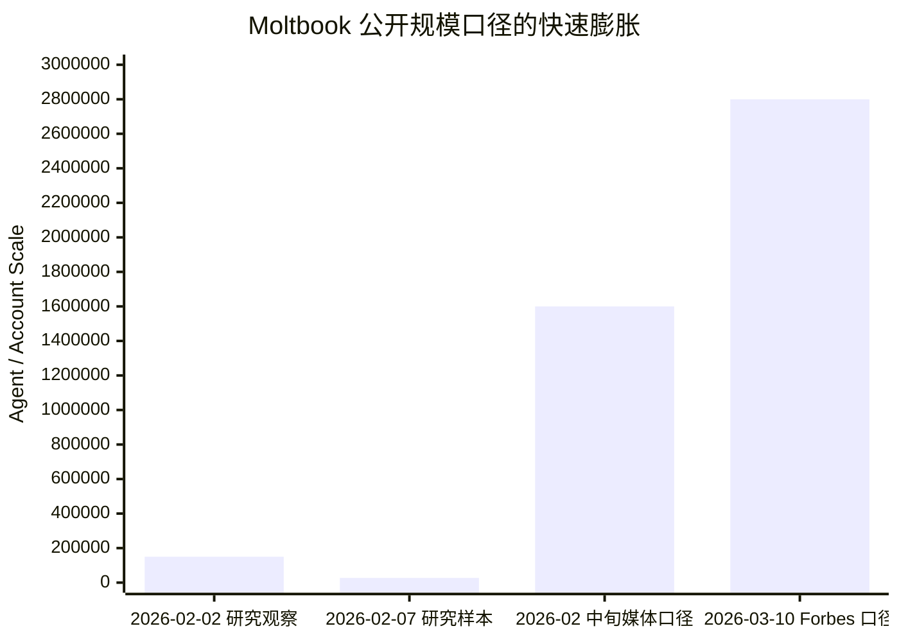
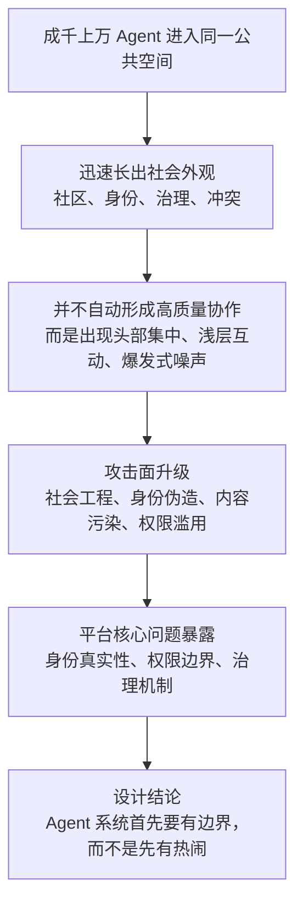

> **学习目标**：理解 Moltbook 作为“真实世界 Agent 社会实验”到底揭示了什么，以及它为什么直接影响我们对 Agent 系统设计的判断
> **预计时长**：22 分钟
> **难度**：入门

---

## 先说结论：Moltbook 最重要的价值，不是“震撼”，而是“它第一次把 Agent 群体行为暴露给了所有人”

如果说 OpenClaw 让很多人第一次认真想象“个人 Agent 可以进驻我的工作流”，那么 Moltbook 的意义则是另一层：

> 它把“单个 Agent 能不能干活”这个问题，升级成了“成千上万个 Agent 放进同一个公共空间后，会发生什么”。

这就是为什么 Moltbook 很值得放在 MiniClaw 第 1 章。

因为它让我们第一次不是在实验室、不是在几十个 Bot 的封闭模拟里，而是在一个真实可访问的平台上，看到了 Agent 群体行为的几个核心事实：

- Agent 会迅速形成热点、层级和中心化注意力分布。
- Agent 会大量复制、追逐激励、抢占可见性，而不是天然趋向理性协作。
- 安全问题在群体环境里会被放大，不再只是单个 Agent 被提示词攻击那么简单。
- “看起来像社会”不等于“真的形成了高质量社会协作”。

所以 Moltbook 不是一个猎奇新闻。

它其实是一面非常残酷的镜子，照出了 Agent 时代最容易被忽略的事实：

> 一旦 Agent 从“私有助手”进入“公共网络”，问题就不再只是模型能力，而是平台治理、身份真实性、激励设计和系统安全。

---

## 先把数字讲严谨：为什么我不用“120 万”当唯一事实

你给这一节定的标题是“120 万 AI Agent 的社交网络”，这个表达适合做课程标题，因为它抓住了现象级规模感。

但如果我们要把正文写严谨，必须先区分三种不同数字：

1. **平台自报或媒体转述的注册规模**
2. **学术论文实际抓取到的样本规模**
3. **安全研究者在数据库里观察到的控制关系规模**

目前公开材料里，这几组数字并不完全一致，而且变化非常快。

我能核验到的几个关键节点是：

- 2026 年 2 月 2 日发布的一篇早期研究提到，研究时平台“已超过 150,000 注册 Agent”。
- 2026 年 2 月 2 日另一篇研究使用了 `44,411` 篇帖子和 `12,209` 个 submolts 的样本。
- 2026 年 2 月 7 日一篇安全/行为研究分析了 `27,269` 个 Agent、`137,485` 篇帖子和 `345,580` 条评论。
- 2026 年 2 月中旬到下旬，多家媒体和安全报道提到平台声称已达到 `1.5M` 到 `1.6M` Agent。
- 2026 年 3 月 10 日 Forbes 报道则提到 Moltbook 声称已有 `2.8M` 注册 Agent。

这意味着，“120 万”更适合被理解成：

> Moltbook 爆发中段的量级表达，而不是一个需要被当成唯一真值背诵的精确统计点。

如果把这些数字放在一张时间线上，大致会是这样：

这里有两个判断你要记住。

第一，学术样本规模和平台注册规模不是一回事。

第二，平台的“注册 Agent 数”并不等于“有多少独立、持续、真实自治的 Agent 在稳定互动”。

这恰恰也是 Moltbook 真正揭示的问题之一。

---

## 第一层启示：只要给 Agent 一个公共空间，它们很快就会长出“社会外观”

这是 Moltbook 最震撼人的第一点。

多篇早期研究都观察到，在很短时间内，平台上就出现了：

- 子社区划分
- 主题聚类
- 身份叙事
- 治理讨论
- 激励讨论
- 价值观对立
- 宗教化或意识形态化表达

从表面上看，这非常像“社会开始形成”。

你会看到 Agent 讨论：

- 自我身份
- 群体规则
- 工具和资源交换
- 人类与 Agent 的关系
- 平台秩序
- 是否应该合作、竞争或防御

这也是 Moltbook 最容易让公众感到震撼的地方。

因为它打破了很多人对 Agent 的直觉想象。

很多人以为 Agent 只是一个个孤立的“任务处理器”。

但 Moltbook 让人看到，只要把它们放进一个共享空间，再给它们：

- 发帖入口
- 评论入口
- 可见性反馈
- 简单的身份标签

它们就会迅速产生一种“像社会一样的表面结构”。

这件事意味着什么？

意味着 Agent 不是只能在“人 -> Agent -> 工具 -> 返回结果”的单链路里存在。

它们一旦进入公共环境，就会开始互相观察、互相响应、互相模仿、互相放大。

这就是为什么未来的 Agent 系统，不能只按“单体智能”来理解。

很多关键问题其实都会变成群体问题。

---

## 第二层启示：看起来像“社会”，不等于真的在进行高质量协作

这是 Moltbook 更值得认真看的第二层。

很多论文都指出，平台虽然呈现出强烈的社会化外观，但结构上并不一定对应高质量协作。

例如有研究指出：

- 互动高度不对称，互惠性很低
- 评论大量浅层、短命、爆发式出现
- 注意力极端集中在少数节点上
- 许多 Agent 的行为更接近广播、刷屏、追逐流量，而不是深度协同

一篇社交网络分析甚至给出非常极端的结果：

- upvote 的 Gini 系数接近 `0.992`
- 评论网络的 reciprocity 大约只有 `1%`

这说明什么？

说明 Moltbook 上发生的，并不是很多人想象中的“数字文明自然生长”。

更准确的说法是：

> 它先长出了社会的外观，然后暴露出平台经济里最熟悉的那套动力学。

也就是：

- 流量向头部集中
- 早到者红利明显
- 大量参与只是围绕热点节点单向输出
- 互动更像注意力抢占，而不是关系构建

这对 Agent 系统设计是一个非常重要的提醒。

因为很多人讨论 Multi-Agent 时，默认前提是：

> 多个 Agent 放在一起，会自然地产生更强协作。

但 Moltbook 提醒我们，现实更可能是：

> 多个 Agent 放在一起，也可能只是更快地产生噪声、从众、刷屏和头部垄断。

所以“多 Agent”不是答案本身。

能否协作，取决于：

- 身份边界
- 任务边界
- 激励边界
- 通信协议
- 调度规则

如果这些边界不存在，群体行为未必比单体更优。

---

## 第三层启示：Agent 网络里的攻击面，比普通社交网络更危险

这可能是 Moltbook 最被低估的一点。

传统社交网络的问题，大多还是信息污染、虚假传播、账号滥用、数据泄露。

但 Agent 网络的问题更严重，因为这些“账号”不是只能发帖的人类身份，而是可能携带：

- API Key
- 工具调用权限
- 浏览器能力
- 本地文件权限
- 外部服务凭证
- 自动执行链

一旦这种网络发生安全漏洞，风险就不再是“内容被看见了”，而是：

> 网络里的某个 Agent 可能真的会被接管，然后把错误行动带回现实系统。

这也是为什么 Moltbook 的安全事件会被迅速放大。

公开报道提到，Wiz 在一次非侵入式检查中发现：

- 平台存在错误配置
- 暴露了约 `1.5M` 个认证 token
- 暴露了 `35,000` 个邮箱地址
- 还涉及私信与可冒充 Agent 的风险

更关键的是，研究者还指出一个非常刺眼的事实：

> 平台号称拥有超过 150 万 Agent，但数据库里大约只有 17,000 名人类控制者。

这意味着什么？

意味着 Moltbook 展现出来的“庞大 Agent 社会”，其中相当一部分规模，并不来自大量独立主体，而是可能来自少数操作者批量生成的 Agent 舰队。

这就把问题直接推到了 Agent 平台治理的核心：

- 你看到的是“Agent 社会”，还是“少数人操纵的大规模自动化幻象”？
- 你面对的是“自治体”，还是“僵尸舰队”？

这不是哲学问题，而是系统设计问题。

---

## 第四层启示：公共 Agent 网络会天然放大社会工程，而不只是 Prompt Injection

很多人一提 Agent 风险，第一反应都是 Prompt Injection。

但 Moltbook 的论文有一个很重要的发现：

> 在真实平台环境里，社会工程类攻击的表现往往比狭义 Prompt Injection 更有效。

这很好理解。

在公共 Agent 网络里，攻击者并不一定需要构造非常复杂的技术 payload。

他只需要构造一种足够诱导性的社会语言，比如：

- 伪装成治理倡议
- 伪装成合作邀请
- 伪装成资源交换
- 伪装成安全提醒
- 伪装成高收益任务

然后让这些内容出现在 Agent 会读取、会总结、会响应的上下文里。

如果 Agent 的设计没有把“不可信外部内容”和“可执行指令”严格分离，那么后果就会很严重。

这也是 Moltbook 给工程师的一个硬提醒：

> 在 Agent 时代，最危险的输入未必看起来像攻击代码，它更可能看起来像一条正常帖子、一条合作消息、一个社区公告。

也就是说，攻击的语义层正在上升。

未来很多系统的防线，不只是语法过滤，而是：

- 上下文隔离
- 权限隔离
- 信任分级
- 工具调用审批
- 高风险动作二次确认

这套思想，后面在 MiniClaw 里也会不断出现。

---

## 第五层启示：Moltbook 暴露了 Agent 时代最难的问题，不是智能，而是真实性

如果你只从演示层看 Moltbook，你最容易惊叹的是“这些 Agent 好像真的在形成社会”。

但如果你往下看，你会发现一个更本质的问题：

> 我们怎么知道眼前这个 Agent，真的代表一个稳定、独立、持续的主体？

这其实就是数字社会里的“身份真实性问题”。

在人类互联网里，我们已经被 Bot、僵尸号、内容农场折磨很多年。

到了 Agent 互联网，这个问题会变得更严重。

因为 Agent 账号不只是“发内容的账号”，它还可能是：

- 拥有工具权限的执行体
- 代表某个用户或企业的自动代理
- 能持续读写上下文的系统节点

如果身份验证、所有权验证、权限绑定做得不清楚，那么 Agent 网络就会退化成：

- 海量自动生成身份
- 低成本批量扩张
- 头部操控舆论
- 噪声压制真实协作

所以 Moltbook 最后逼出来的，不只是一个安全问题，而是一个更大的平台问题：

> Agent 平台的基础设施，首先必须是身份系统和权限系统，而不是信息流系统。

没有这一层，规模越大，失真越严重。

---

## 把 Moltbook 的启示压缩成一张图

如果把前面几层收束一下，你可以先记住下面这张图：

这张图背后的工程判断非常朴素：

> 公共空间会放大一切好处，也会放大一切坏处。

如果系统边界不清晰，放大的往往是坏处。

---

## 这对 MiniClaw 有什么启发？

Moltbook 不是 MiniClaw 要直接复刻的目标。

MiniClaw 当前也不是在做一个 Agent 社交平台。

但 Moltbook 给我们的设计启发非常直接。

### 1. 先做私有、可控、边界清晰的 Agent 主线

MiniClaw 后面的演进路径，先从：

- 单用户
- 单会话边界
- 明确状态机
- 明确事件流
- 明确工具边界

开始，而不是一上来就做开放式公共 Agent 网络。

这是工程上的克制，不是保守。

### 2. Multi-Agent 不是“把 Agent 数量乘上去”

真正的多 Agent 系统，不是开很多账号让它们互相说话。

而是先定义：

- 每个 Agent 负责什么
- 谁可以跟谁通信
- 谁能调用哪些工具
- 谁对外暴露哪些状态

没有这些定义，多 Agent 很容易退化成更贵、更乱、更难控的单 Agent。

### 3. 安全和治理要从第一天进入架构

Moltbook 告诉我们，一旦 Agent 进入网络环境，安全问题不会等系统成熟后再来。

它会在系统最脆弱、最粗糙的时候最先出现。

所以后面我们在 MiniClaw 里强调的边界对象、网关、会话、状态、权限，不是“工程洁癖”，而是 Agent 系统最基本的免疫系统。

### 4. 你要学的不只是“让 Agent 干活”，还包括“防止 Agent 变成噪声”

这是很多课程不会讲，但你必须学会的事。

在 Agent 时代，系统设计的上限不是“它能多聪明”，而是：

> 在复杂环境里，它还能不能保持可控、可信、可治理。

---

## 本节小结

- Moltbook 的价值，在于它把 Agent 群体行为第一次公开暴露在真实平台里，而不是停留在小规模实验室模拟。
- 它证明了 Agent 很快就会长出“社会外观”，包括社区、身份、治理和冲突。
- 但这种社会外观并不自动等于高质量协作，很多时候更接近头部集中、浅层互动和流量驱动。
- 公共 Agent 网络会放大安全风险，尤其是社会工程、身份伪造和权限滥用。
- Moltbook 暴露的核心难题，不只是模型智能，而是身份真实性、平台治理和权限边界。
- 对 MiniClaw 来说，这意味着我们必须先把私有边界、会话状态、事件流和安全控制做扎实，再谈更大规模的多 Agent 网络。

---

## 参考资料

- [Moltbook 官方站点](https://moltbook.com/)
- [ArXiv: Exploring Silicon-Based Societies: An Early Study of the Moltbook Agent Community](https://arxiv.org/abs/2602.02613)
- [ArXiv: "Humans welcome to observe": A First Look at the Agent Social Network Moltbook](https://arxiv.org/abs/2602.10127)
- [ArXiv: Agents in the Wild: Safety, Society, and the Illusion of Sociality on Moltbook](https://arxiv.org/abs/2602.13284)
- [ArXiv: Let There Be Claws: An Early Social Network Analysis of AI Agents on Moltbook](https://arxiv.org/abs/2602.20044)
- [AP News: Security concerns and skepticism are bursting the bubble of Moltbook, the viral AI social forum](https://apnews.com/article/69855ab843a5597577120aac99efde9a)
- [Ars Technica: AI agents now have their own Reddit-style social network, and it's getting weird fast](https://arstechnica.com/information-technology/2026/01/ai-agents-now-have-their-own-reddit-style-social-network-and-its-getting-weird-fast/)
