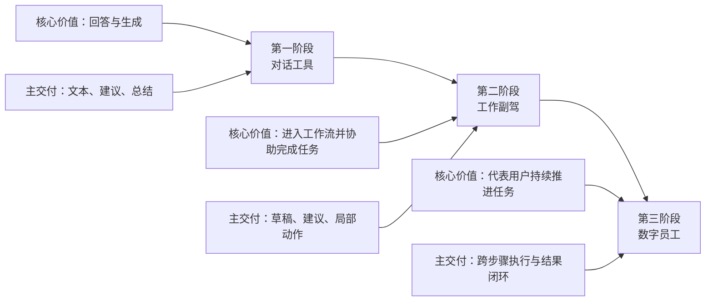

> **学习目标**：建立一条足够清晰的 AI 产品演进主线，理解为什么 Agent 不是“更强的聊天机器人”，而是一次产品范式和系统范式的切换
> **预计时长**：20 分钟
> **难度**：入门

---

## 先说结论：Agent 不是突然出现的，它是三次产品范式连续推进的结果

今天很多人讨论 Agent，喜欢把它说成一种横空出世的新物种。

但如果你把时间线拉长，会发现它并不是平地起高楼。

更准确的说法应该是：

> Agent 是过去几轮 AI 产品形态持续推进后的自然结果。

这条推进链，我建议你先记成三段：

1. **对话工具**
   重点是“回答问题”。
2. **工作副驾**
   重点是“进入工作流、辅助完成任务”。
3. **数字员工**
   重点是“代表你持续执行、跨步骤推进、在边界内自主完成结果”。

这三段并不是绝对互斥。

今天很多产品同时带着前两段甚至三段的特征。

但它们的主导逻辑已经明显不同。

如果你搞不清这三段，后面你在设计 Agent 系统时，就很容易犯两个错误：

- 以为 Agent 只是“聊天 + 工具调用”
- 以为只要模型足够强，就自然会变成“数字员工”

这两种理解都不够。

真正重要的不是模型参数，而是：

- 用户如何发起任务
- 系统如何理解上下文
- 执行链如何被编排
- 结果如何持续回流
- 风险如何被约束

这些东西，正是从第一段到第三段逐步长出来的。

---

## 第一阶段：对话工具，解决的是“信息获取”和“语言表达”

第一阶段最典型的产品形态，就是 ChatGPT 爆发初期那一类系统。

它们的核心价值非常直接：

- 帮你问答
- 帮你写作
- 帮你总结
- 帮你翻译
- 帮你改写

这类产品第一次把大模型从研究演示变成了大众工具。

从用户角度看，它最大的突破不是“自动执行”，而是：

> 机器第一次在自然语言层面，足够接近一个随时可调用的知识接口。

这一步为什么重要？

因为它改写了人机交互的最低门槛。

过去要让系统帮你干活，通常需要：

- 菜单
- 表单
- 按钮
- 参数配置
- API 调用

而对话工具把入口统一成了一句自然语言。

这一步的历史意义非常大。

但它的边界也同样明显。

对话工具本质上仍然是：

- 一问一答
- 单轮或短程交互
- 输出以文本为主
- 价值主要停留在“建议”和“表达”

也就是说，它更像一个高质量的信息接口，而不是执行系统。

你问它一个问题，它给你一个回答。

你让它改一段文字，它给你一个版本。

但大部分情况下，真正把事情做完的那个人还是你。

所以第一阶段的关键词不是“做事”，而是：

> 让 AI 成为随时可调用的语言与知识工具。

这也是为什么这一阶段的产品虽然非常强，但还不能称为真正意义上的 Agent。

---

## 第二阶段：工作副驾，解决的是“把 AI 接进真实工作流”

第二阶段的代表形态，就是各种 Copilot 式产品。

这里的关键变化是：

> AI 不再只是一个独立聊天窗口，而是开始进入具体软件、具体场景、具体工作流。

例如：

- 进入 IDE，帮助写代码、解释报错、修改函数
- 进入 Office，帮助整理文档、表格、邮件、会议记录
- 进入客服、销售、HR、财务流程，帮助检索、建议、草拟和跟进

这个阶段为什么叫“工作副驾”？

因为它已经不只是回答问题，而是在工作现场陪你一起完成任务。

但它依然有一个非常鲜明的特征：

> 它通常仍然需要人类在主驾驶位。

也就是说：

- 任务是你来定义的
- 关键确认是你来做的
- 最终提交通常还是你来按按钮
- AI 的价值主要是加速，而不是完全接管

微软对 Copilot 与 autonomous agents 的区分就很典型。

在官方表述里，Copilot 是你的 AI assistant，而 autonomous agents 更强调代表个人、团队或职能去执行和编排业务流程。

这说明到第二阶段，产业界其实已经意识到：

“会辅助”和“会代办”不是一回事。

工作副驾阶段最重要的贡献，是帮 AI 长出了三样关键能力：

1. **场景嵌入**
   AI 不再漂浮在聊天框里，而是进入真实软件与企业流程。

2. **上下文连接**
   AI 开始读取邮件、文档、代码库、业务数据、知识库。

3. **局部动作能力**
   AI 开始不只是说，还能局部操作，例如修改文件、生成草稿、触发流程、调用系统能力。

这一阶段已经非常接近 Agent。

但它还不够。

因为它更像一个强力助手，而不是一个可持续运行的执行体。

---

## 第三阶段：数字员工，解决的是“代表你持续推进任务”

这才是真正意义上 Agent 开始成熟的阶段。

当我们说“数字员工”时，不是说 AI 已经真的和一个成熟员工完全等价。

这里说的是它的产品形态发生了变化：

> 用户不再只是向它要一个答案，而是把一个目标、一组约束、一段上下文交给它，然后让它持续推进。

这一阶段的典型信号非常明显：

- 它会自己决定下一步做什么
- 它会在多个步骤之间切换
- 它会调用浏览器、文件、终端、业务系统
- 它会在必要时向你确认
- 它会把任务从“收到请求”推进到“拿到结果”

OpenAI 在 2025 年 1 月推出 Operator 时，官方强调的是它能“用自己的浏览器”去执行网页任务。

到 2025 年 7 月，OpenAI 又把 Operator 和 deep research 融合进 ChatGPT agent，官方表述变成：

- 它能在 web 上行动
- 能在研究与执行之间切换
- 能完成更复杂的 online tasks

Anthropic 在 computer use 文档里则展示了另一条路线：

- 让模型看到桌面
- 控制桌面
- 搭配 bash、编辑器和其他工具形成更完整的自动化链

微软则在 autonomous agents 的产品叙事里，把重点放在：

- 代表团队或职能执行流程
- 连接系统记录
- 自动完成 lead qualification、supplier communications、employee self-service 等业务流程

你会发现，这一阶段和前两阶段的真正区别，不在于“模型更聪明”，而在于：

> 系统从“回答器”变成了“执行者”。

这就是数字员工阶段最核心的变化。

---

## 把三阶段压缩成一张图

如果你现在只想抓住主干，可以先看这张图：

你应该注意到，这不是简单的“能力增强”。

它更像三次角色变化：

- 第一阶段，AI 是回答者。
- 第二阶段，AI 是副驾。
- 第三阶段，AI 是被授权的执行者。

角色一变，系统结构就必须跟着变。

---

## 为什么第三阶段不能靠“更强模型”自动长出来？

这是理解 Agent 最关键的一点。

很多人看到第三阶段，会本能地以为：

> 等模型再强一点，不就自然从 Copilot 变成 Agent 了吗？

不是。

因为从工作副驾到数字员工，中间跨越的不是“智力差距”，而是“系统差距”。

你需要的新增结构至少包括：

- 任务生命周期管理
- 长链路状态管理
- 工具与权限边界
- 中间事件回传
- 失败恢复与重试
- 人类确认点
- 审计与治理

如果这些结构不存在，那么再强的模型也只能表现为：

- 偶尔惊艳
- 经常失控
- 难以追踪
- 难以复现
- 难以治理

也就是说，第三阶段的门槛并不是“它会不会点网页”，而是：

> 你有没有能力把它放进一个可控的执行系统里。

这也是为什么 MiniClaw 整门课后面会花大量篇幅去做：

- LLM Client
- Gateway
- RPC
- EventBus
- SessionStateMachine
- SessionLane

这些结构表面上看不如“一个会自动买票的 Agent”酷。

但没有它们，所谓数字员工就只是一次性 Demo。

---

## 三阶段的分水岭，分别是什么？

到这里，我们可以把三次范式转变的分水岭讲得更硬一点。

### 从对话工具到工作副驾

真正的分水岭不是“回答更准了”，而是：

> AI 开始进入具体软件、具体岗位、具体流程。

这一步让 AI 从通用语言界面，变成了工作系统的一部分。

### 从工作副驾到数字员工

真正的分水岭不是“多接了几个工具”，而是：

> AI 开始对任务结果负责，而不只是对回答质量负责。

一旦责任对象从“回答”变成“结果”，系统就必须长出状态、边界、确认、回滚和审计。

这就是为什么第三阶段会逼出完全不同的工程架构。

---

## 为什么“数字员工”这个说法既有价值，也有危险？

我愿意用这个说法，但必须给你一个提醒。

它有价值，是因为它非常准确地抓住了第三阶段的关键变化：

- 不只是辅助
- 不只是建议
- 不只是旁路能力
- 而是开始在边界内代你执行

但它也有危险。

因为“数字员工”这个说法很容易让人误以为：

> AI 只要接上工具，就已经拥有一个成熟员工的稳定性、责任感和可靠性。

这显然不成立。

真实情况是：

- 它可能很强，但仍不稳定
- 它可能很快，但仍会误判
- 它可能能干活，但并不天然可信

所以更准确的工程态度应该是：

> 把它当成“高能力、低稳定性、需要被边界约束的数字执行体”。

只有这样，你才不会在系统设计上过度乐观。

---

## 这对 MiniClaw 有什么启发？

这节课不是为了给你一个流行名词表。

真正重要的是，这条三阶段主线直接决定了 MiniClaw 为什么要这样设计。

### 1. MiniClaw 不是要做一个更漂亮的聊天界面

如果目标只是第一阶段，那么一个不错的聊天 UI 加一个模型调用器就够了。

但 MiniClaw 明显不是冲这个去的。

### 2. MiniClaw 也不满足于只做“工作副驾”

Copilot 形态当然很重要，但如果系统始终停留在“你每一步都得手动推动”，那它离真正的 Agent 还差一截。

### 3. MiniClaw 的目标，是向第三阶段靠近

也就是：

- 让系统能承接任务
- 让系统能管理会话
- 让系统能输出中间事件
- 让系统能在边界内推进执行

这也是为什么后面的代码不会围着“Prompt 技巧”展开，而会围着“系统结构”展开。

因为第三阶段拼的不是会不会聊天，而是能不能稳定运转。

---

## 本节小结

- Agent 不是突然出现的新物种，而是对话工具、工作副驾、数字员工三次连续演进后的结果。
- 第一阶段解决的是“问答与表达”，第二阶段解决的是“进入工作流并协助任务”，第三阶段解决的是“代表用户持续推进任务”。
- 从第二阶段到第三阶段，跨越的不是模型参数差距，而是系统结构差距。
- 真正的 Agent 不只是会调用工具，而是必须拥有任务生命周期、状态管理、权限边界和结果闭环。
- “数字员工”是一个有用但危险的比喻，它强调执行能力，但不能掩盖稳定性和治理问题。
- MiniClaw 的目标不是做一个更强聊天框，而是向第三阶段的可控执行系统靠近。

---

## 参考资料

- [OpenAI: Introducing Operator](https://openai.com/index/introducing-operator/)
- [OpenAI: Introducing ChatGPT agent: bridging research and action](https://openai.com/blog/introducing-chatgpt-agent/)
- [OpenAI Help: ChatGPT agent release notes](https://help.openai.com/en/articles/11794368-chatgpt-agent-release-notes)
- [Anthropic Docs: Computer use tool](https://docs.anthropic.com/en/docs/agents-and-tools/tool-use/computer-use-tool)
- [Microsoft Official Blog: New autonomous agents scale your team like never before](https://blogs.microsoft.com/blog/2024/10/21/new-autonomous-agents-scale-your-team-like-never-before/)
