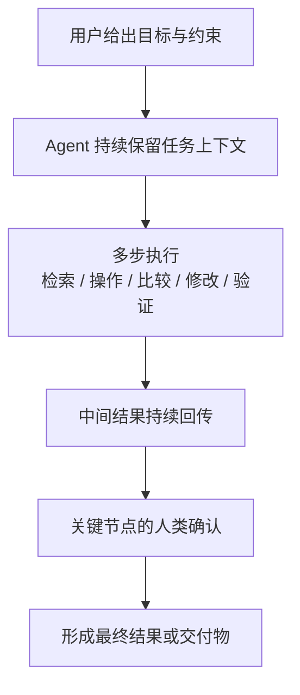

> **学习目标**：通过三个真实世界案例，建立对 Agent 能力边界的立体判断，不再停留在“它会不会调 API”的层面
> **预计时长**：24 分钟
> **难度**：入门

---

## 先说结论：Agent 真正有价值的地方，不是“会做小任务”，而是“能接住高成本任务”

很多 Agent 演示都很像样：

- 帮你订个餐
- 帮你查个天气
- 帮你发个邮件
- 帮你填个表单

这些功能当然有意义，但如果整天只看这些例子，你很容易误判 Agent 的真正价值。

因为这类任务有两个问题：

第一，它们太小了。

小到你很难区分：

- 这是一个真正的 Agent
- 还是一个“包装得更漂亮的自动化脚本”

第二，它们的错误代价太低了。

低到你看不出来一个系统到底有没有：

- 状态管理
- 权限边界
- 错误恢复
- 结果验证
- 人类确认链路

所以想判断 Agent 到底是不是开始进入真实生产力阶段，最好的方法不是看它能不能完成“小动作”，而是看它能不能承接那些：

- 时间成本高
- 信息复杂度高
- 跨步骤
- 错误代价高
- 需要持续推进

的任务。

这一节我故意挑三个层次很不一样的例子：

1. **自主买车**
   代表高价值消费决策与多约束信息筛选。
2. **代码迁移**
   代表复杂专业工作流与系统级执行。
3. **40 小时深度调研**
   代表长链路认知劳动与多源信息综合。

这三个例子放在一起看，你会发现 Agent 的能力并不是一条线性曲线，而是三种不同的难题：

- 决策型任务
- 执行型任务
- 研究型任务

---

## 案例一：自主买车，为什么它是“消费决策型 Agent”的代表场景

“买车”这个例子看起来很生活化，但其实特别能暴露 Agent 的真实能力边界。

因为买车不是一个单点动作，而是一条完整决策链：

- 明确预算
- 明确使用场景
- 比较车型
- 比较总拥有成本
- 识别经销商报价
- 谈判附加条件
- 检查金融方案
- 安排试驾
- 决定最终交易

这类任务最麻烦的地方在于，它不是“搜到信息”就结束了。

它要求系统持续维持一套目标函数：

- 预算上限是多少
- 家庭用车还是通勤用车
- 更重视空间还是保值率
- 能否接受二手车
- 是否有置换
- 是否需要贷款

也就是说，这类任务天然适合 Agent，而不只是聊天机器人。

为什么？

因为它需要的不只是知识，而是跨步骤目标保持。

从公开资料看，汽车行业已经明显把“买车代理”当成一个重点方向。

例如：

- Microsoft 在官方消费者文章里已经把“用 AI 工具完成购车比较、价格研究和金融选择”当成现实流程来讲。
- CarEdge 在 2025 年汽车购买者研究里明确指出，AI 已经开始进入买车流程。
- PYMNTS 在 2025 年关于汽车行业 agentic AI 的报道里，直接把问题写成了“lot to bot”，也就是从看车场到代理式购车。

但这里必须说实话：

> 今天公开世界里，最成熟的还不是“完全自主买车”，而是“AI 辅助购车决策与流程推进”。

这恰好很有教育意义。

因为它说明高价值消费任务里，Agent 已经能明显承担：

- 资料搜集
- 选项压缩
- 多维比较
- 谈判建议
- 表单和流程推进

但在最终交易层，通常仍然要保留人类确认。

这不是能力不够炫，而是高风险任务的合理边界。

换句话说，买车案例最重要的启发不是：

> Agent 已经可以无脑替你刷卡买车。

而是：

> Agent 已经开始胜任“高成本决策代理”的前 80% 工作，而最后 20% 必须由权限、确认和责任链托住。

这对 MiniClaw 很重要。

因为它告诉我们，高价值任务的 Agent 系统必须内建：

- 约束条件
- 阶段性确认
- 决策日志
- 最终授权点

---

## 案例二：代码迁移，为什么它是“执行型 Agent”的代表场景

如果说买车更像消费决策型任务，那么代码迁移就是另一个极端：

> 它是典型的系统执行型任务。

代码迁移为什么特别适合作为 Agent 案例？

因为它同时满足这几个条件：

- 步骤很多
- 上下文很长
- 依赖关系复杂
- 局部修改可能引发全局错误
- 需要反复验证

这意味着它明显超出了“写一段代码补全”的范畴。

你让一个普通聊天机器人帮你迁移代码，它通常会停留在：

- 告诉你应该怎么改
- 给你一个示例
- 帮你写一个局部 patch

但真正的代码迁移不是这样完成的。

真实迁移往往要求：

- 先读现有代码结构
- 找到模式
- 批量改动多文件
- 运行测试
- 修修补补
- 再跑验证
- 最后形成 PR 或提交结果

这就是一个典型的 Agent 工作流。

OpenAI 在官方《How OpenAI uses Codex》里已经把 “Refactoring and migrations” 当成真实使用场景，明确提到：

- 变更多个文件或包
- 大范围替换旧模式
- 迁移新依赖
- 跨几十个文件保持一致更新

其中有个很有代表性的团队反馈，大意是：

> Codex 在几分钟内把遗留的 `getUserById()` 模式批量替换成了新服务模式，并直接打开了 PR，这本来要花几个小时。

Anthropic 这边也有很强的公开信号。

例如：

- Rakuten 的 Claude Code 案例提到，团队实现了长达 `7 小时` 的持续自主编码。
- Anthropic 的代码现代化材料里，已经把 language migration、dependency modernization、legacy refactor 视为 agentic coding 的重点场景。

这一类案例说明什么？

说明 Agent 在代码场景里的真正价值，不是“比人写得更优雅”，而是：

> 它可以在一个明确边界里，持续推进原本需要大量上下文切换的人类工程劳动。

但同样要注意边界。

公开研究也反复指出，代码迁移场景里当前 Agent 的典型失败点包括：

- 覆盖率看起来高，但测试通过率低
- 语法改了，语义没保住
- 能处理局部模式，却难以稳定处理系统级约束

所以代码迁移案例给我们的结论不是“工程师没用了”，而是：

> Agent 已经能承担复杂软件劳动里高度结构化、可验证、可回滚的一大部分工作，但前提是系统里必须有测试、状态、验证和人类审阅。

你应该马上联想到 MiniClaw 后面的设计重点：

- 会话
- 事件
- 状态机
- 可观察执行链

因为这些东西在编码 Agent 场景里不是锦上添花，而是底线。

---

## 案例三：40 小时深度调研，为什么它是“研究型 Agent”的代表场景

第三个案例代表的是另一类完全不同的认知劳动。

不是买东西，不是改代码，而是：

> 大量阅读、多源检索、交叉比对、形成结构化结论。

这类任务过去非常难自动化。

因为它的难点不在一个动作，而在一长串认知链条：

- 明确问题
- 拆分子问题
- 找资料
- 识别可靠来源
- 比对冲突信息
- 抽取关键信号
- 形成报告

OpenAI 在官方 deep research 发布文里对它的定义非常直接：

- 多步骤 online research
- 查找、分析、综合大量网络来源
- 在几十分钟内完成本来要花人类数小时的任务

官方文档里给出的典型时长是 `5 到 30 分钟`。

但这个功能引发行业震动，不是因为“能省 30 分钟”，而是因为它让很多人第一次认真相信：

> 一整块中等复杂度的知识工作，可以被 Agent 先做完大部分，再由人类做验证和收尾。

WIRED 在报道里引用 Wharton 教授 Ethan Mollick 的一句判断，非常有代表性。

他对 deep research 的感受大意是：

> 它能先替你做掉 40 小时左右的中等强度工作，而你只需要再花大约 1 小时检查。

这里要注意，这不是 OpenAI 官方 SLA，也不是稳定承诺。

它更像一个教育界和知识工作者对这类工具冲击感的描述。

但它依然很重要。

因为它说明了一件事：

> Agent 在研究型任务里，真正改变的不是“回答质量”，而是“前置劳动量”。

传统问答工具的逻辑是：

- 你来搜
- 你来读
- 你来整理
- 最后让 AI 帮你润色

研究型 Agent 的逻辑则变成：

- 你定义任务
- AI 先去搜、读、整理、结构化
- 你再检查、裁决、修正

这其实是一次分工重写。

所以“40 小时深度调研”这个例子最值得记住的，不是某个夸张时长，而是：

> Agent 已经开始吞掉认知劳动里最耗时间、最机械但又最不能完全省略的那一段前置工作。

这会对咨询、研究、投研、战略、内容分析、竞品分析产生非常直接的影响。

---

## 把三个案例放在一起看：Agent 真正强的是哪一层？

如果把买车、代码迁移、深度调研放在一起看，你会发现它们表面完全不同，但系统上其实共用一组底层能力：

你看，不管是买车、迁移代码还是做研究，它们本质上都不是单轮问答。

它们真正依赖的是：

- 目标保持
- 上下文保持
- 多步执行
- 中间状态回传
- 最终确认

这就是 Agent 和传统聊天工具真正拉开差距的地方。

---

## 三个案例各自暴露了什么边界？

为了避免你看完以后只剩下“Agent 很强”的印象，我们再把边界说清楚。

### 1. 自主买车暴露的是“责任边界”

AI 可以帮你做大量前置决策工作，但最后签字、支付、承担后果的仍然是人。

所以这类系统最关键的不是更聪明，而是：

- 约束清晰
- 授权清晰
- 决策可追溯

### 2. 代码迁移暴露的是“验证边界”

AI 可以大规模改代码，但如果没有测试、回归、审查，它就很可能把“看起来完成了”伪装成“真的完成了”。

所以这类系统的核心不是生成能力，而是：

- 可验证
- 可回滚
- 可审查

### 3. 深度调研暴露的是“可信度边界”

AI 可以搜得很快、读得很多、整理得很漂亮，但它不天然保证：

- 来源可靠
- 推理严谨
- 结论没有偏差

所以研究型 Agent 的关键不是写得长，而是：

- 来源链透明
- 证据可回查
- 结论可复核

---

## 这对 MiniClaw 有什么启发？

这三个案例其实都在把你推向同一个结论：

> Agent 系统真正值钱的不是“会不会调用工具”，而是“能不能在边界内把长任务稳定跑完”。

这句话听起来很简单，但它几乎定义了 MiniClaw 后面的全部工程重点。

因为只要你真的想做这三类任务中的任何一种，系统就必须具备：

- 长会话能力
- 实时事件回传
- 可控路由
- 工具边界
- 状态流转
- 出错恢复

这也是为什么 MiniClaw 后面会强调：

- Gateway
- Session
- EventBus
- StateMachine
- Lane

这些看起来没有“买车”“迁移”“调研”那么直观的底层结构。

因为没有它们，前面那三个案例都只会停留在偶发演示，而不是稳定能力。

---

## 本节小结

- Agent 真正有价值的地方，不是完成小任务，而是承接高时间成本、高复杂度、高错误代价的长任务。
- 自主买车代表决策型任务，代码迁移代表执行型任务，40 小时深度调研代表研究型任务。
- 这三类案例都说明：Agent 的核心不是单轮回答，而是目标保持、上下文保持、多步执行和结果闭环。
- 它们也分别暴露了三种关键边界：责任边界、验证边界、可信度边界。
- 对 MiniClaw 来说，这些案例证明了为什么我们必须建设会话、状态、事件和权限边界，而不是只做一个更会聊天的系统。

---

## 参考资料

- [OpenAI: Introducing deep research](https://openai.com/index/introducing-deep-research/)
- [WIRED: OpenAI’s Deep Research Agent Is Coming for White-Collar Work](https://www.wired.com/story/openais-deep-research-agent-is-coming-for-white-collar-work/)
- [OpenAI: How OpenAI uses Codex](https://openai.com/business/guides-and-resources/how-openai-uses-codex/)
- [Anthropic: Rakuten accelerates development with Claude Code](https://www.anthropic.com/customers/rakuten)
- [Anthropic: The Code Modernization Playbook](https://resources.anthropic.com/hubfs/ebook-code-modernization-playbook-01_update%202%20%281%29.pdf?hsLang=en)
- [Microsoft 365: How to buy a new car with AI tools](https://www.microsoft.com/en-us/microsoft-365-life-hacks/everyday-ai/how-to-buy-new-car-with-ai-tools)
- [CarEdge: 2025 AI & Car Buying Study](https://caredge.com/guides/2025-car-buying-ai-trends)
- [PYMNTS: Agentic AI Rewrites the Auto Buying Playbook From Lot to Bot](https://www.pymnts.com/news/artificial-intelligence/2025/agentic-ai-rewrites-the-auto-buying-playbook-from-lot-to-bot/)
