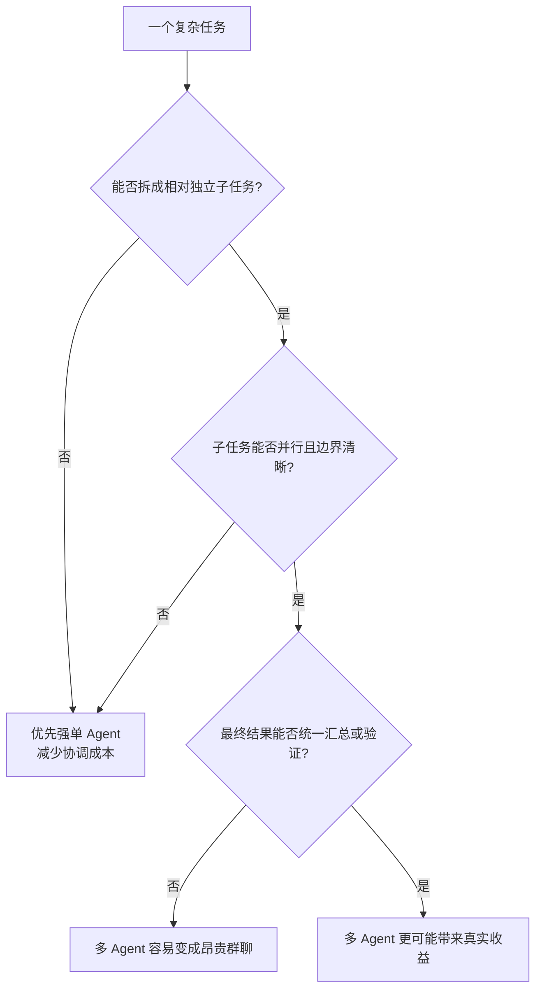

> **学习目标**：理解多 Agent 为什么在一些任务上显著强于单 Agent，同时也知道它什么时候会更差、更贵、更难控
> **预计时长**：24 分钟
> **难度**：入门

---

## 先说结论：多 Agent 的价值，不是“人数更多”，而是“把一个大问题拆成多个可控问题”

很多人第一次听到 Multi-Agent，会下意识把它理解成一句很粗糙的话：

> 一个 Agent 不够强，那就多叫几个。

这个理解太表面了。

真正有效的多 Agent 系统，并不是把多个模型同时丢进一个房间，让它们自由聊天。

它真正解决的问题是：

> 当一个任务过大、过长、过复杂，以至于单个 Agent 很难同时兼顾规划、执行、验证、记忆和边界控制时，能不能把这个任务拆成若干相对独立、相对清晰、相对可验证的小问题？

如果答案是可以，那么多 Agent 往往会更强。

如果答案是不可以，那么多 Agent 很可能更差。

所以这一节的重点不是给你灌输“多 Agent 一定更先进”，而是帮你建立一个更靠谱的判断：

- 为什么多 Agent 会强
- 它强在哪些任务
- 它为什么也经常翻车
- 最后 MiniClaw 应该学它的哪一部分，而不是照搬热闹表象

如果你能抓住这几个问题，后面你在设计 Agent 系统时，就不会犯两个典型错误：

- 要么什么都想塞给一个“超级 Agent”
- 要么一遇到复杂任务就条件反射式地上多 Agent 编排

这两种极端都不对。

---

## 第一层原因：多 Agent 最直接的优势，是并行

这是最好理解的一层。

单 Agent 的天然弱点之一，是它大多数时候只能顺序推进。

即便它可以连续用工具，它通常也还是：

- 先想一步
- 查一个方向
- 得到结果
- 再决定下一步

这在简单任务里没问题。

但只要任务开始变成“要同时探索多个方向”，单 Agent 就会很吃亏。

Anthropic 在 2025 年讲自家多 Agent Research 系统时，给了一个非常有代表性的结论：

- 他们发现多 Agent 系统特别适合 breadth-first 的查询，也就是需要同时追多条线索的问题。
- 在内部 research eval 上，`Claude Opus 4 + Sonnet 4` 的多 Agent 组合，比单 Agent `Claude Opus 4` 高出 `90.2%`。

这个数字当然是特定任务下的内部评测，不应该被拿去当成普遍真理。

但它说明了一件很重要的事：

> 当任务天然可并行时，多 Agent 最大的价值不是“更聪明”，而是“同时展开更多探索”。

比如研究一个复杂主题时，你完全可以让不同 Agent 同时去做：

- 查公司名单
- 查财务数据
- 查监管信息
- 查竞争对手
- 查公开争议

然后再由一个 lead agent 收敛。

这和让一个 Agent 顺序做完所有事情，效率差异会非常大。

所以多 Agent 的第一性价值，首先不是人格化分工，而是：

> 用多个上下文窗口同时工作，把串行任务变成并行任务。

---

## 第二层原因：多 Agent 的核心优势，是职责分离

如果说并行解决的是速度问题，那么职责分离解决的是复杂度问题。

一个“超级 Agent”为什么经常表现不稳？

因为它往往被迫同时处理太多角色：

- 规划者
- 检索者
- 执行者
- 验证者
- 汇总者
- 与用户对话的接口

这些角色混在一个 Agent 里时，常见问题是：

- 指令过长
- 目标冲突
- 工具选择混乱
- 结果难以审计
- 容易在一次长链路里逐渐偏航

而多 Agent 的一个非常自然的做法，就是把这些角色拆开。

例如：

- `Planner` 负责拆任务
- `Researcher` 负责找资料
- `Executor` 负责调工具
- `Verifier` 负责检查结果
- `Coordinator` 负责收敛与回传

OpenAI 在《A practical guide to building agents》里给出的建议非常克制，但很有价值：

- 一般建议先把单 Agent 做到极限
- 当 prompt 里条件分支太多、逻辑太复杂、工具重叠太严重时，再考虑拆成多个 Agent

这说明多 Agent 真正的价值，不是让系统“更酷”，而是让系统：

> 每个组件都只承担更窄、更清晰的职责。

而职责越清晰，系统通常越容易：

- 提示词设计
- 工具对齐
- 错误定位
- 单独评估
- 局部替换

所以多 Agent 的第二个核心优势，其实非常工程化：

> 它让复杂问题从“一个大而乱的智能体”变成“若干边界清楚的协作单元”。

---

## 第三层原因：多 Agent 通过上下文隔离，减少“一个大脑里什么都在打架”的问题

这一点很容易被忽视，但非常关键。

单 Agent 在处理复杂任务时，经常会遇到一种隐形问题：

> 所有信息都挤在同一个上下文窗口里。

这会带来几种常见后果：

- 历史信息越来越长
- 重要信息被埋掉
- 不同子任务互相污染
- 推理路径对后续步骤产生强路径依赖

Anthropic 在多 Agent research 系统里特别强调过一点：

> subagent 的价值之一，是它们拥有各自独立的 context window，可以分别探索不同方面，再把结果压缩返回给 lead agent。

这句话背后的工程意义很大。

因为它说明多 Agent 不只是“人多力量大”，它更像一种内存管理策略。

也就是说：

- 不是让一个 Agent 背所有东西
- 而是让不同 Agent 分别背自己那部分东西

这样做的好处是：

- 减少无关信息干扰
- 避免上下文互相污染
- 降低长链路中间漂移
- 让每个 Agent 的目标更单纯

这对很多复杂任务都很重要。

尤其是：

- 研究任务
- 多系统编排任务
- 长会话计划任务
- 多文档综合任务

这些任务如果都塞进一个超长上下文，很容易表面上“全都记住了”，实际上“全都开始混”。

所以多 Agent 的第三个价值，是：

> 用上下文隔离换取更稳定的局部推理。

---

## 第四层原因：多 Agent 并不是为了“模仿组织结构”，而是为了获得更好的系统边界

很多人讲多 Agent，最爱讲“像公司一样，有 CEO、有员工、有审核员”。

这种类比有时候有帮助，但也很容易误导。

因为如果你只盯着“像公司”，就会以为多 Agent 的价值来自拟人化组织结构。

其实不是。

它真正的价值来自边界。

你可以把它理解成这样：

- 单 Agent 更像一个大函数，所有逻辑混在一起
- 多 Agent 更像多个模块，每个模块有输入、输出和责任范围

模块化的好处是什么？

- 容易替换
- 容易测试
- 容易定位错误
- 容易做权限控制

例如一个 verifier agent 理论上就不该拥有：

- 支付权限
- 删除文件权限
- 外部发消息权限

它只需要拥有“读结果并打分”的权限。

而 executor agent 可能需要更多工具权限，但不应该拥有“改评估标准”的权限。

这就是多 Agent 最实在的一层收益：

> 它给了你做权限最小化和风险隔离的机会。

这件事在生产环境里比“更像组织”重要得多。

---

## 但必须说清楚：多 Agent 并不总是更强

如果这一节只讲多 Agent 的优点，那就是在灌鸡汤。

现实恰恰复杂得多。

2026 年的一篇研究《Rethinking the Value of Multi-Agent Workflow: A Strong Single Agent Baseline》专门提出了一个非常重要的反例：

> 很多看起来表现不错的多 Agent workflow，本质上只是“同一个基座模型在不同提示词下分角色工作”，而这些 workflow 很可能可以被一个强单 Agent 用多轮执行模拟出来。

这篇研究的结论并不是“多 Agent 没价值”，而是：

- 强单 Agent 是一个必须认真对比的 baseline
- 许多同构多 Agent 系统的收益，可能被高估了
- 多 Agent 会带来显著协调成本
- 真正难以被单 Agent 模拟的，往往是异构、多工具、强边界、强并行的系统

OpenAI 在自己的实战指南里也给出了非常一致的建议：

> 一般应先最大化单 Agent 的能力，再考虑拆成多 Agent。

为什么？

因为多 Agent 的代价非常真实：

- token 更多
- 调试更难
- 追踪更难
- 结果协调更难
- 重复劳动更容易发生
- 错误传播链更长

Anthropic 也明确提到：

- 他们的数据里，多 Agent 系统大约会用到聊天交互 `15x` 的 token
- 并不是所有任务都适合多 Agent
- 很多 coding task 因为并行性不够，未必是理想目标

所以这节最重要的一句话也许是：

> 多 Agent 的问题从来不是“能不能做”，而是“这件事值不值得拆”。

---

## 真正有效的前提：任务必须“可分”

到这里，可以把判断条件说得更硬一点。

什么情况下，多 Agent 更可能有效？

通常至少满足下面三点：

1. **任务能拆成相对独立的子问题**
   例如多路调研、多语言翻译、多站点检索。

2. **子问题之间不需要高频同步**
   如果每一步都要彼此确认，那协调开销会迅速吞掉收益。

3. **最终结果能被汇总或验证**
   否则你只会得到一堆各说各话的局部结果。

如果不满足这三点，多 Agent 很容易退化成：

- 更贵
- 更慢
- 更乱

这个判断可以压缩成一张图：

如果你以后设计系统时能先问这三个问题，基本就不会滥用多 Agent。

---

## 两种最常见的多 Agent 模式

为了后面进入工程实现时不抽象，我们先把最常见的两种模式说清楚。

### 1. Manager / Orchestrator 模式

这是最常见也最适合初学者理解的一种。

它的逻辑是：

- 一个 lead agent 负责理解总目标
- 它把子任务分发给多个专门 agent
- 最后再把结果收回来统一整理

OpenAI 在 Agents 指南里把这种方式写得很明确，称作 `manager pattern`。

这种模式适合：

- 用户只想跟一个总入口对话
- 需要统一口径和统一输出
- 子任务适合被工具化或子代理化

### 2. Decentralized / Handoff 模式

这种模式不要求永远有一个中心调度者。

逻辑更像：

- 一个 agent 判断问题不属于自己
- 直接把执行权 handoff 给另一个 agent
- 后者接手继续完成

这种模式更适合：

- 明确的专业分流
- 服务台、客服、工单流转
- 角色边界稳定的业务系统

你会发现，这两种模式背后的核心不是“几个 Agent”，而是：

> 谁拥有当前执行权，谁负责上下文，谁对结果收敛负责。

这几个问题不定义清楚，多 Agent 就会很快失控。

---

## 为什么“一群 Agent”有时确实比“一个超级 Agent”更强？

现在我们终于可以回答标题里的问题了。

严格地说，不是“任何一群 Agent 都比一个超级 Agent 强”。

更准确的说法是：

> 当任务天然可分、需要并行、需要上下文隔离、需要更清晰的责任边界时，一组协作良好的 Agent 往往比一个试图什么都做的超级 Agent 更强。

“更强”主要体现在四个维度：

- **更快**：能并行探索多个方向
- **更稳**：每个 Agent 只承担更窄职责
- **更清晰**：系统边界更容易定义
- **更可控**：权限和风险更容易分层管理

而“超级 Agent”的问题则是：

- 它看起来统一，实际上可能过载
- 它看起来聪明，实际上容易混乱
- 它看起来万能，实际上很难治理

所以真正的对立不是：

- 单 Agent vs 多 Agent

而是：

- 无边界的单体智能体
- 有分工、有验证、有边界的协作系统

---

## 这对 MiniClaw 有什么启发？

MiniClaw 当前显然不会一上来就做一个复杂的公共多 Agent 平台。

这不是能力问题，而是路线问题。

但多 Agent 这节仍然非常重要，因为它提前告诉了我们后面的架构方向。

### 1. 先把单 Agent 主线做稳

这也是 OpenAI 和很多工程实践都在强调的路线。

先把：

- 会话
- 路由
- 状态
- 事件
- 工具调用

做稳，单 Agent 才有资格演化成多 Agent。

### 2. 后续如果做多 Agent，重点不是“人数”，而是“边界”

真正值得学的不是让很多 agent 互相聊天，而是：

- 如何分工
- 如何 handoff
- 如何汇总
- 如何验证

### 3. MiniClaw 后续天然适合 manager pattern

从课程当前路线看，最自然的方向不是先做完全去中心化网络，而是：

- 一个统一入口
- 一个总协调层
- 若干边界明确的子能力

这和 manager / orchestrator 模式是天然一致的。

所以你可以把这一节理解成一次提前铺垫：

后面课程虽然暂时先做单 Agent 主线，但架构思维已经在向“未来可拆成多 Agent”做准备。

---

## 本节小结

- 多 Agent 真正的价值，不是“人数更多”，而是把复杂任务拆成多个边界清晰、可并行、可验证的子任务。
- 它最核心的优势来自四件事：并行、职责分离、上下文隔离、权限分层。
- 但多 Agent 并不总是更好，协调成本、token 成本、调试复杂度都可能吞掉收益。
- 工程上更稳的原则是：先把单 Agent 做强，再在确实需要时拆成多 Agent。
- 真正适合多 Agent 的任务，必须满足“可分、可并行、可汇总”三个条件。
- 对 MiniClaw 来说，当前最重要的不是直接堆多 Agent，而是先把未来可演化的入口、会话、状态和事件边界做清楚。

---

## 参考资料

- [Anthropic: How we built our multi-agent research system](https://www.anthropic.com/engineering/multi-agent-research-system)
- [OpenAI: A practical guide to building agents](https://cdn.openai.com/business-guides-and-resources/a-practical-guide-to-building-agents.pdf)
- [ArXiv: Rethinking the Value of Multi-Agent Workflow: A Strong Single Agent Baseline](https://arxiv.org/abs/2601.12307)
- [Google Developers Blog: Announcing the Agent2Agent Protocol (A2A)](https://developers.googleblog.com/a2a-a-new-era-of-agent-interoperability/)
