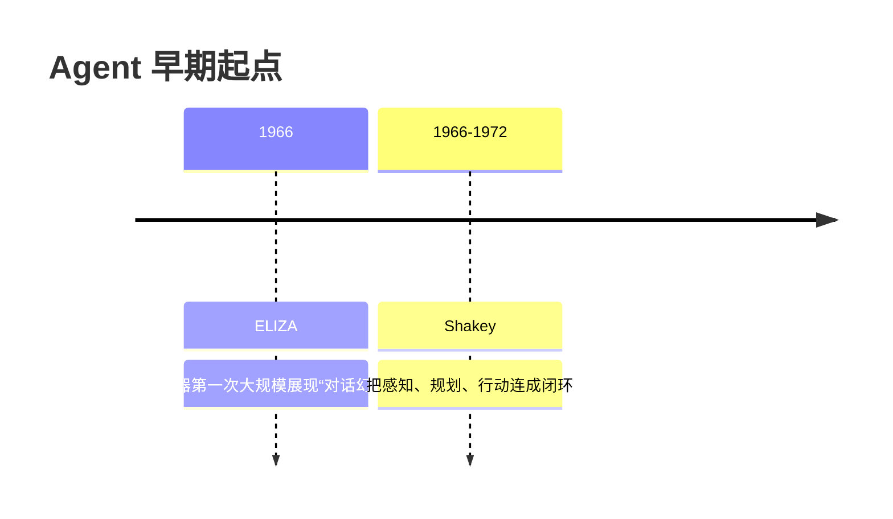
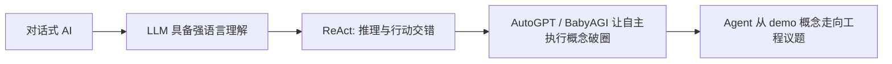
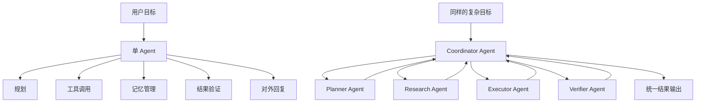
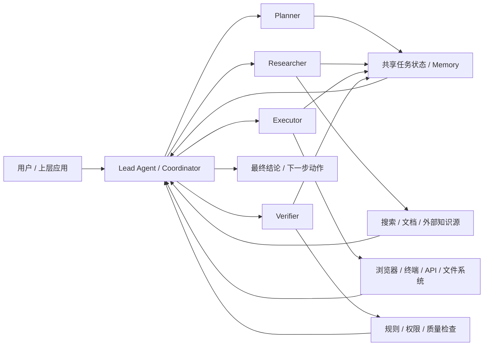
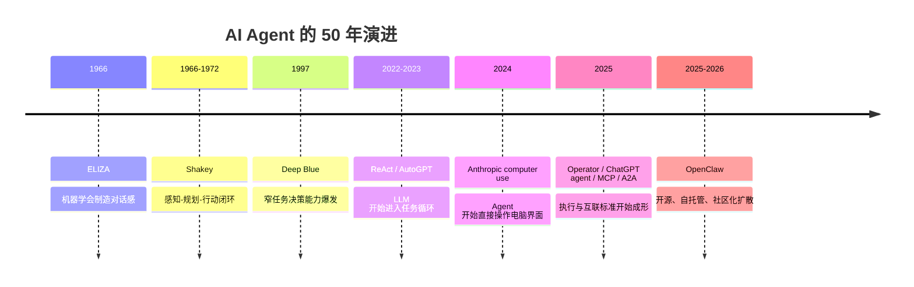

> **学习目标**：看清 AI Agent 不是横空出世的概念，而是一条跨越 50 多年的技术演化链；理解每一代系统分别解决了什么问题，又卡在了哪里  
> **预计时长**：15 分钟  
> **难度**：入门

---

## 先说结论：OpenClaw 不是历史的起点，而是几条旧路线第一次合流

如果只看 2025 到 2026 年的热度，很容易产生一种错觉：

> Agent 仿佛是一夜之间突然出现的新物种。

这当然不对。

今天我们说的 Agent，其实是几条长期路线第一次在同一个时间点上汇合了：

- 让机器“像人在对话”这条路线
- 让机器“能规划行动”这条路线
- 让机器“能连接外部工具和环境”这条路线
- 让机器“能在开放世界中持续执行任务”这条路线

OpenClaw 之所以显得像一个分水岭，不是因为它发明了这些思想，而是因为它把这些能力第一次用开源、自托管、工程可复制的方式打包到了普通开发者面前。

所以这一节不只是讲历史八卦，而是要回答三个更重要的问题：

- Agent 这件事到底老在哪里
- 它真正新的部分又在哪里
- 为什么 MiniClaw 要学的是“历史积累后的结构”，而不是某一个爆款项目的表面形态

---

## 第一阶段：1960 年代，机器先学会“像人在说话”

很多人把 Agent 的起点理解成“大模型会调用工具”，这太晚了。

真正更早的起点，其实是人类第一次认真感受到：

> 机器也许不只是计算器，它似乎可以成为一个会回应你的对象。

1966 年，Joseph Weizenbaum 发表了著名的 ELIZA 工作。  
ELIZA 并不理解世界，它主要依靠模式匹配来模拟一位罗杰斯学派心理咨询师的说话方式。

从今天看，它非常原始。

但它历史地位极高，因为它第一次大规模暴露了一个事实：

> 只要机器能在语言层面维持一种“看起来像理解”的互动，人类就会自发赋予它意图、人格和理解力。

这件事对后来的 Agent 发展影响极深。

为什么？

因为 Agent 从来不只是“能不能做事”的问题，它始终还包括：

- 人会不会把它当作一个可委托的对象
- 人愿不愿意持续把任务交给它
- 人是否误以为它比实际更懂自己、更懂环境

也就是说，ELIZA 虽然不是现代 Agent，但它把 Agent 世界里最核心的人机心理学前提提前暴露出来了：

> 人类极其容易把流畅交互误判成真实能力。

这也是为什么今天所有 Agent 产品都必须同时处理两件事：

- 提高真实执行能力
- 控制“看起来像懂了”的幻觉风险

---

## 第二阶段：1960 到 1970 年代，机器开始学会“规划并行动”

如果说 ELIZA 解决的是“互动外观”，那与它几乎同时期出现的另一条路线，解决的就是“行动结构”。

SRI 的 Shakey 项目通常被视为早期 AI Agent 历史里更接近现代定义的一条主线。  
根据 SRI 的官方介绍，Shakey 在 1966 到 1972 年间展示了感知环境、建模环境、规划路径、移动和操作简单物体的能力。

它重要的地方，不在于能力强，而在于结构已经很像今天很多 Agent 系统的骨架：

- 先感知环境
- 再表示当前状态
- 然后生成计划
- 最后执行动作
- 执行后再根据环境反馈修正下一步

这已经不是“聊得像人”，而是“为了目标而行动”。

你会发现，今天的网页 Agent、代码 Agent、桌面 Agent，本质上也还是这条链：

- 观察当前页面或上下文
- 形成内部状态判断
- 生成下一步行动
- 调用工具或执行操作
- 读取反馈并继续

所以从系统论角度看，Shakey 带来的不是一个古老案例，而是一种持续沿用到今天的基本框架：

> Agent = 感知 + 状态表示 + 规划 + 行动 + 反馈

MiniClaw 后面做的很多事，实际上也都能映射回这个框架。  
只不过我们的“环境”不再是实验室地板和木块，而是 Web、API、文件系统、消息流和人类任务。

---

## 第三阶段：1990 年代到 2010 年代，AI 很强，但还不是今天意义上的 Agent

接下来这段历史最容易被误读。

1997 年 IBM Deep Blue 击败 Garry Kasparov，成为历史性的 AI 里程碑。  
它说明机器可以在高度结构化环境中做出远超人类顶尖选手的决策。

但它为什么不算我们今天说的 Agent？

因为它强在单一封闭任务中求最优，而不是在开放环境里接受模糊目标、调用外部资源、持续执行多步任务。

这段时期其实有很多“很强的 AI”，却没有真正大规模形成“通用可委托 Agent”，原因主要有四个：

- 世界接口不统一，工具、系统、网页和软件之间缺少标准化连接层
- 模型缺少强通用语言能力，难以把自然语言目标稳定翻译成执行计划
- 长链路任务太脆弱，系统无法在多步过程中持续纠错
- 成本和工程门槛太高，普通开发者很难快速搭一个可用闭环

所以这几十年更像是在不断积累零部件：

- 更强的搜索和规划
- 更好的语音和语言接口
- 更成熟的人机交互范式
- 更多软件系统的 API 化

这些积累在当年没有爆成“Agent 时代”，是因为它们还没被一个足够通用的认知接口串起来。

这个认知接口，后来由大语言模型补上。

---

## 第四阶段：2022 到 2023 年，LLM 把“会说话”变成“会调用工具”

真正让“Agent”重新成为主流议题的，不是某一个具体产品，而是大语言模型把几件过去分散的能力第一次粘在了一起：

- 用自然语言理解模糊目标
- 用自然语言表示中间计划
- 根据上下文决定下一步动作
- 用文本把工具调用结果重新纳入推理过程

2023 年前后，这种变化开始从论文走向工程实践。

一个非常关键的节点是 ReAct。  
这项工作明确提出：模型不应该只“想”，也不应该只“做”，而应该把 reasoning 和 acting 交错起来。

这件事为什么关键？

因为它把现代 Agent 的核心循环讲清楚了：

1. 先根据当前状态推理
2. 再执行一个动作
3. 读取环境返回
4. 再继续推理和下一步动作

这和单轮问答已经不是一回事了。

也是在这一波里，AutoGPT、BabyAGI 之类的项目迅速出圈。  
它们不一定都成熟，但它们把“让模型围绕目标持续自我推进”这个想法第一次大规模传播给了开发者社区。

这一阶段的贡献，不是把 Agent 彻底做成，而是完成了观念转换：

> LLM 不只是回答问题的引擎，它也可以成为任务循环里的控制器。

不过当时的系统还普遍存在几个问题：

- prompt 驱动过重，行为稳定性不足
- 记忆和状态管理很脆弱
- 工具调用协议不统一
- 错误恢复能力很差
- 很多“自主”其实只是长 prompt 下的脆弱串联

所以 2023 年的 Agent 热潮更像是：

> 大家第一次看见方向，但离工程化落地还很远。

---

## 第五阶段：2024 到 2025 年，Agent 开始真正接触“真实世界接口”

如果说 2023 年让人看见了方向，那么 2024 到 2025 年才真正让 Agent 接上现实世界。

这两年最重要的变化，不是模型参数继续变大，而是三个工程层突破开始成形：

### 1. Agent 能直接操作界面

2024 年 10 月，Anthropic 推出 computer use。  
这意味着模型不再只停留在“调用抽象工具”的层面，而是开始尝试看屏幕、移动光标、点击按钮、输入文字。

这件事的历史意义很大。

因为现实世界里大量软件系统并没有为 Agent 准备好干净的 API。  
如果一个系统只提供人类图形界面，那么“像人一样操作电脑”就成为一种非常现实的补全方式。

这让 Agent 的能力边界突然扩展了：

- 能跨站点
- 能跨旧系统
- 能处理没有 API 的软件
- 能把“数字劳动力”这个说法第一次变得更具体

### 2. Agent 开始拥有更标准的工具连接层

Anthropic 推出的 MCP，把“模型如何接工具和数据源”这件事推向了标准化。  
Google 在 2025 年发布 A2A，则把“不同 Agent 如何互相通信协作”推向了标准化。

这两个方向很关键，因为它们分别对应 Agent 工程化里最难的两个问题：

- Agent 怎么接世界
- Agent 怎么接彼此

一旦连接层和协作层开始标准化，Agent 才有机会从一堆孤立 demo 进化成可组合系统。

### 3. 产品形态开始从“回答你”转向“替你做”

2025 年 1 月，OpenAI 发布 Operator；2025 年 7 月，OpenAI 又把相关能力整合进 ChatGPT agent。  
这类产品已经不再只是陪你讨论方案，而是开始直接接管浏览器、研究流程、表格处理和多步骤任务。

这时 Agent 的产品定义发生了本质变化：

> 它不再只是一个更会聊天的助手，而是一个能在你授权下代表你行动的执行层。

到了这一阶段，很多团队也开始发现一个现实问题：

> 当任务变成长链路、跨系统、需要多角色判断时，把所有职责都塞进一个 Agent，稳定性会迅速下降。

这就是多 Agent 架构开始普及的背景。它不是为了“看起来更高级”，而是因为系统复杂度已经逼着工程设计做拆分。

这张图想表达的只有一件事：

- 单 Agent 的问题不是不能做，而是所有责任挤在一个上下文里
- 多 Agent 的价值不是“多几个模型”，而是把规划、检索、执行、验证拆成边界更清晰的协作单元

也正因为如此，2024 到 2025 年你会看到行业里一边在做更强单 Agent，一边也在做多 Agent 编排与协作协议。

---

## 第六阶段：2025 到 2026 年，OpenClaw 让 Agent 从“大厂能力”变成“开源可复制能力”

到了这里，才终于轮到 OpenClaw。

OpenClaw 真正值得写进历史线的原因，不是因为它是第一款 Agent 产品，而是因为它把前面几十年积累下来的几条路线，第一次以一种极度可传播的方式重新打包了：

- 对话入口足够简单
- 本地运行和自托管足够有吸引力
- 工具、技能、插件和外部系统连接足够丰富
- 开源代码让系统边界可见、可改、可复制
- 社区分发让“别人做好的能力”可以被快速复用

如果把 ELIZA 看成“让人愿意对机器讲话”，把 Shakey 看成“让机器为了目标行动”，把 ReAct 看成“让模型把推理和行动串起来”，把 Operator / computer use 看成“让 Agent 接管真实软件界面”，那么 OpenClaw 的位置更像是：

> 让普通开发者第一次以低门槛方式拥有一套可部署、可组合、可传播的 Agent 操作系统雏形。

这就是它和早期 Agent 框架最大的不同。

很多更早的 Agent 项目也很重要，但它们往往停在：

- 研究 demo
- 开发者实验框架
- 云上闭源能力
- 难以大规模复用的 prompt orchestration

而 OpenClaw 把 Agent 从“概念演示”往“社区基础设施”推进了一步。

如果把这一代系统抽象成一张更贴近工程实现的图，它通常长这样：

这已经很接近今天很多开源 Agent 系统和企业 Agent 平台的核心形态了：

- 最上层是任务入口
- 中间是协调者和若干专职 Agent
- 下面接真实工具、运行时环境和状态层
- 最后把中间过程收敛成一个可交付结果

从历史上看，这一层结构非常重要，因为它说明 Agent 终于不再只是“一个聪明的对话体”，而开始变成“一个可拆、可协作、可审计的系统”。

---

## 用一张图看懂这 50 年到底变了什么

你会发现，这条历史线真正推进的，不是单一指标，而是五件事一起前进：

- 语言理解越来越强
- 规划和推理越来越灵活
- 工具连接越来越标准
- 执行环境越来越真实
- 分发和复用越来越便宜

只有当这五件事在同一个时代同时成熟，Agent 才会从“研究概念”真正变成“产业现象”。

---

## 为什么过去 50 年一直有 Agent 思想，但直到最近才爆发

这是最值得停一下的问题。

如果 Agent 的核心思想这么早就有，为什么偏偏是这两年突然爆发？

因为过去一直缺的不是“单点思想”，而是“最低可用组合”。

历史上每一代系统都只解决了其中一部分：

- ELIZA 有交互，没有真实行动
- Shakey 有规划和行动，但环境过于封闭
- Deep Blue 有强决策，但任务过于狭窄
- 早期智能助手有接口，但缺少长链路推理
- 早期 LLM Agent 有自主性想象，但工程稳定性不足

直到近两年，几个条件才第一次同时出现：

- LLM 足够擅长理解模糊自然语言目标
- 工具调用和外部连接开始标准化
- 浏览器、终端、桌面等执行环境被纳入 Agent 控制范围
- 云服务和开源社区让能力分发成本大幅下降
- 用户心智也已经从“问答”逐渐转向“委托”

所以真正爆发的不是某个单点突破，而是：

> 技术成熟度、产品入口、社区传播和用户心理预期在同一个时间窗口对齐了。

这也是为什么今天看 OpenClaw，不能只把它理解成“一个火起来的开源项目”，而要把它放进一条更长的历史线上看。

---

## 对 MiniClaw 的启发：我们真正要学的，不是热点名称，而是历史沉淀下来的系统骨架

把这段历史放回课程，你会发现 MiniClaw 的设计目标其实非常克制。

我们不是要复刻每一代 Agent 的表面形态，而是要提取其中真正稳定的结构：

- 从 ELIZA 学到：入口和交互心智极其重要
- 从 Shakey 学到：感知、状态、规划、行动、反馈必须闭环
- 从 ReAct 学到：推理和执行不能被割裂成两套系统
- 从 MCP / A2A 学到：连接和协作需要协议层
- 从 OpenClaw 学到：真正能扩散的系统，必须工程边界清晰、能力可组合、部署门槛足够低

这也是为什么 MiniClaw 最后会收束成一个五层架构，而不是一堆“魔法功能”。

因为历史已经反复证明：

> Agent 真正难的从来不是让模型多说几句，而是让系统在开放环境里稳定地感知、决策、执行、回传和演进。

---

## 这一节你应该记住什么

如果把 50 年历史压缩成三句话，我希望你记住的是：

1. Agent 不是新概念，它至少可以追溯到 1960 年代的对话系统和规划机器人。
2. 近两年的变化不在于“第一次有人想到 Agent”，而在于语言模型、工具协议、执行环境和开源分发第一次同时成熟。
3. OpenClaw 的历史意义，不是发明 Agent，而是把 Agent 变成了普通开发者也能部署、改造、传播的开源系统。

下一节我们会把视角从“历史”切到“当下生态”，具体看 OpenAI、Anthropic、Google 以及国内厂商分别在 Agent 版图上占据什么位置。

---

## 参考资料

- Joseph Weizenbaum, *ELIZA—A Computer Program for the Study of Natural Language Communication Between Man and Machine*, 1966 / MIT Press 收录页
- SRI, [Shakey the Robot](https://www.sri.com/hoi/shakey-the-robot/)
- IBM, [From checkers to chess: A brief history of IBM AI](https://www.ibm.com/products/blog/from-checkers-to-chess-a-brief-history-of-ibm-ai)
- Google Research / arXiv, [ReAct: Synergizing Reasoning and Acting in Language Models](https://arxiv.org/abs/2210.03629)
- Anthropic 帮助中心与 MCP 官方文档，关于 Model Context Protocol 的介绍
- Anthropic, computer use 官方发布材料，2024-10-22
- OpenAI, [Introducing Operator](https://openai.com/index/introducing-operator/)
- OpenAI, [ChatGPT agent release notes](https://help.openai.com/en/articles/11794368-chatgpt-agent-release-notes)
- Google Developers Blog, [Announcing the Agent2Agent Protocol (A2A)](https://developers.googleblog.com/a2a-a-new-era-of-agent-interoperability/)
- OpenClaw 官方仓库与官方文档
