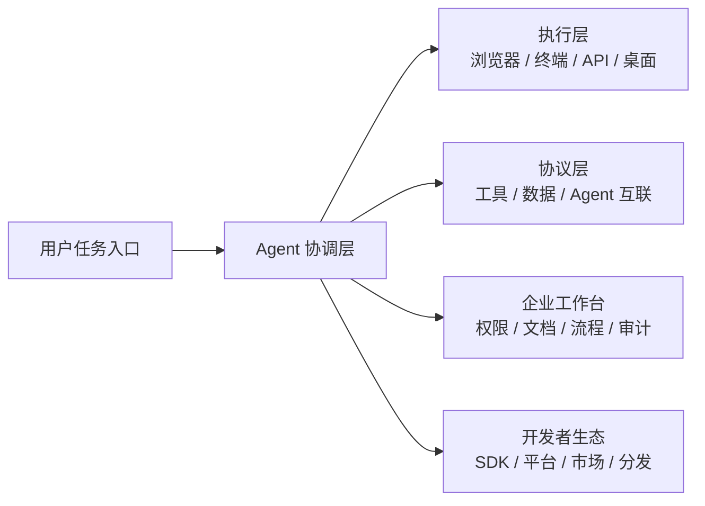
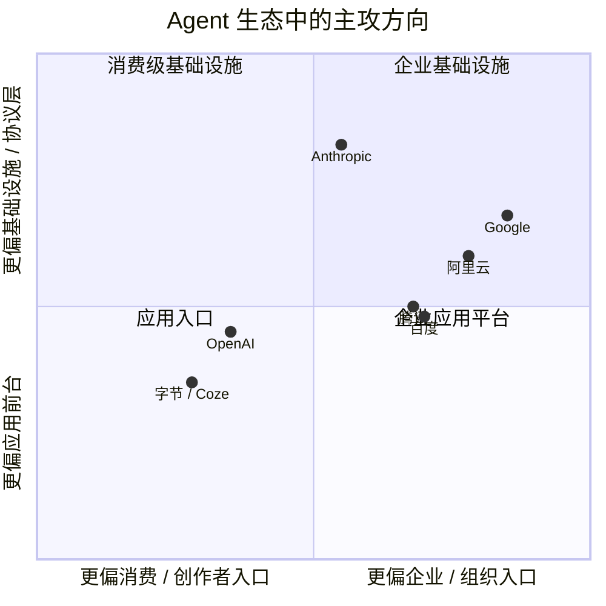
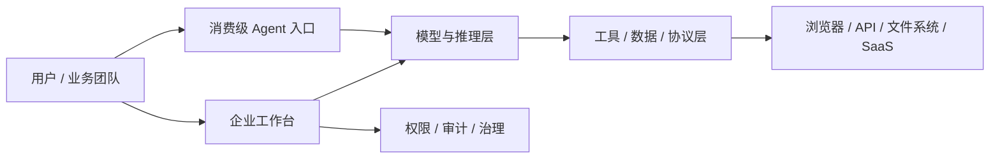

> **学习目标**：理解当下 Agent 生态不是“谁模型更强”这么简单，而是不同厂商在争夺不同层级的控制点  
> **预计时长**：18 分钟  
> **难度**：入门

---

## 先说结论：今天的 Agent 竞争，本质上是在争五个控制点

如果你只从新闻标题看市场，很容易以为大家都在做同一件事：

- 做更强模型
- 做 Agent
- 做工作流
- 做企业智能体平台

但如果把这些公司拆开看，你会发现它们其实并不在同一个层面正面肉搏。

今天的 Agent 竞争，真正争夺的是五个控制点：

1. **用户入口**
   谁先成为用户发起任务的默认界面
2. **执行层**
   谁能稳定地接管浏览器、终端、桌面、API 和外部软件
3. **工具协议层**
   谁来定义模型如何接工具、接数据源、接其他 Agent
4. **企业工作台**
   谁能接企业内部文档、系统、权限和流程
5. **开发者生态**
   谁能让更多人低成本搭建、部署、分发和复用 Agent

这也是为什么 OpenAI、Anthropic、Google、国内厂商看起来都在讲 Agent，但路线却差异很大。

理解这一点之后，下面这些厂商的差异就会清晰很多。

---

## OpenAI：抢的是“用户默认入口 + 通用执行层”

OpenAI 在 Agent 生态里的最大优势，不只是模型能力，而是它最先把 Agent 做成了一个大量用户可直接感知的产品入口。

从官方节奏看，这条路线很清楚：

- 2025 年 1 月，OpenAI 发布 [Operator](https://openai.com/index/introducing-operator/)
- 2025 年 7 月，OpenAI 把 Operator 能力进一步整合进 [ChatGPT agent](https://openai.com/blog/introducing-chatgpt-agent/)
- 同期又通过 [Responses API](https://openai.com/index/new-tools-for-building-agents/) 和 [Responses API 新工具](https://openai.com/index/new-tools-and-features-in-the-responses-api/) 把“构建 Agent”的能力开放给开发者

从这条路径你能看出 OpenAI 的核心打法：

> 先占住用户任务入口，再把浏览器、研究、终端、连接器这些执行能力折叠进一个统一体验里。

官方 system card 对 ChatGPT agent 的描述很典型：它把 deep research、Operator 的浏览器能力、带有限制的终端、以及连接外部数据源的 connectors 合并到了同一个 agentic product 里。

这意味着 OpenAI 不是把 Agent 当成一个零散功能，而是试图把它变成：

- 一个消费者入口
- 一个办公入口
- 一个研究入口
- 一个执行入口

### OpenAI 的强项

- 用户心智最强，很多人第一次接触 Agent 就发生在 ChatGPT 里
- 产品闭环完整，从任务发起到执行反馈都是统一体验
- API 层也在同步推进，给开发者提供内建工具和 agent primitives
- 自有产品验证快，能用 ChatGPT 直接教育市场

### OpenAI 的局限

- 产品体验强，但系统内部可见性和可改造性相对有限
- 更适合“拿来即用”的通用 Agent，不一定最适合需要深度自定义的企业编排
- 生态控制力很强，但也意味着开发者很容易被绑定在 OpenAI 的产品与 API 设计里

如果用一句话概括 OpenAI 的位置，它更像：

> Agent 时代的超级前台。

---

## Anthropic：抢的是“开发者主战场 + 协议层 + 高可信执行”

Anthropic 的路线和 OpenAI 明显不同。

它当然也在做终端与执行能力，比如官方文档里的 [computer use](https://docs.anthropic.com/en/docs/build-with-claude/computer-use) 允许 Claude 通过截图、鼠标和键盘控制桌面环境；同时 Claude Code 也被 Anthropic 明确放在开发者工作流的核心位置。

但 Anthropic 更有代表性的战略，不是“把所有用户都拉进一个前台”，而是：

> 让 Claude 成为开发者、企业和第三方产品背后的 Agent 引擎。

最能代表 Anthropic 生态地位的，其实是两件事：

### 1. MCP 抢的是工具连接标准

Anthropic 推出的 Model Context Protocol，本质上是在回答一个高频工程问题：

> 模型到底应该怎样以统一方式接工具、接知识源、接外部系统？

一旦这个协议被广泛接受，谁控制协议，谁就在 Agent 生态里掌握了很强的话语权。

因为协议层不像产品入口那么显眼，但它会深刻影响：

- 工具接入成本
- 平台兼容性
- 开发者迁移成本
- 生态网络效应

### 2. Claude Code 抢的是专业开发者心智

Anthropic 官方已经把 Claude Code 明确成独立产品线，而且文档体系、CLI 体验和安全说明都很完整。  
这说明 Anthropic 对“Agent for software engineering”不是试水，而是明确押注。

这条路线很重要，因为编码场景天然适合 Agent：

- 有明确目标
- 有可观测环境
- 有工具反馈
- 有验证闭环
- 有高频高价值用户

### Anthropic 的强项

- 在开发者圈层和 coding agent 场景里影响力很强
- 更重视协议、工具调用和系统可组合性
- computer use 让它在“真实界面执行”上也很有代表性
- 路线更偏底层基础设施，适合做生态中枢

### Anthropic 的局限

- 在大众用户入口上的压制力不如 ChatGPT
- 更偏开发者与企业导向，产品传播面没有 OpenAI 那么天然广
- 它的很多优势是“工程价值”，不是“消费级爆点”

如果用一句话概括 Anthropic 的位置，它更像：

> Agent 时代的基础设施派和协议派。

---

## Google：抢的是“企业工作台 + 数据连接器 + 组织级分发”

Google 的打法又不一样。

如果说 OpenAI 是从消费入口往企业延伸，Anthropic 是从开发者和协议往外扩，Google 更像是直接从企业工作台切入。

Google Cloud 官方对 [Agentspace](https://cloud.google.com/agentspace/docs) 的定义非常直白：

> 它是 intranet search、AI assistant 和 agentic platform 的组合。

后续产品页面又明确说明，Agentspace 已并入 [Gemini Enterprise](https://cloud.google.com/products/agentspace)，重点是让组织里的每个员工都能搜索、分析、创建并运行 AI agents。

这说明 Google 想抢的核心控制点不是“聊天入口”，而是：

- 企业知识入口
- 企业搜索入口
- 企业连接器入口
- 企业内部 agent gallery / 分发入口

这条路线为什么有竞争力？

因为企业真正落地 Agent 时，最痛的往往不是模型不够强，而是：

- 数据散落在不同 SaaS 和内部系统里
- 权限体系复杂
- 合规要求严格
- 需要统一审计、统一连接、统一管理

Google 在这块的天然优势来自：

- Workspace 生态
- Cloud 基础设施
- 企业搜索与数据连接能力
- 多种预置连接器

### Google 的强项

- 企业场景天然强，尤其擅长“连接组织内数据”
- Agent 不只是对话体，而是和企业搜索、知识访问、权限控制绑在一起
- 比起单点 demo，更强调组织级部署和治理

### Google 的局限

- 对普通开发者的心智占领不如 OpenAI / Anthropic 鲜明
- 产品叙事偏企业化，不像消费级 Agent 那么容易形成社交传播
- 很多能力的价值要进入企业环境后才充分显现

如果用一句话概括 Google 的位置，它更像：

> Agent 时代的企业中台和组织连接器提供者。

---

## 国产厂商：更强调“低代码智能体平台 + 云生态落地 + 渠道分发”

国内厂商的打法和海外三家又不完全一样。

如果粗略归纳，当前国内主流路线更像是：

- 先做模型底座
- 再做低代码或零代码智能体平台
- 再把平台能力接到云服务、办公系统、内容渠道和行业场景里

这条路线背后的现实很直接：

> 国内市场对“马上能落地、能接业务、能被非技术团队使用”的要求通常比“纯研究前沿”更高。

### 1. 阿里云：押注企业应用构建与云内权限体系

阿里云百炼官方文档明确把应用构建分成三类：

- Agent
- Workflow
- 高代码应用

这很能说明阿里的思路。  
它不是只讲一个万能 Agent，而是把应用形态分层，强调知识库检索增强、外部工具调用、记忆和复杂任务规划。

更值得注意的是，阿里已经把 [Agent Identity](https://help.aliyun.com/zh/agentidentity/using-agentidity-in-high-code) 这样的能力推到台前，也就是让智能体访问敏感云服务前必须经过授权。

这说明阿里抢的不是“一个好玩的 Agent demo”，而是：

- 企业内可控执行
- 云上权限治理
- 面向真实业务流程的可落地系统

### 2. 百度：押注 AppBuilder、搜索与组件化工作流

百度千帆 [AppBuilder](https://ai.baidu.com/tech/AppBuilder) 的官方定位非常鲜明：画布式编排、预置组件、多轮对话编排、接入业务系统，还把百度搜索等官方组件作为卖点。

这条路线背后有两个明显优势：

- 百度长期积累的搜索和信息获取能力
- 把智能体做成“可拖拽、可编排、可快速集成”的应用工作台

所以百度更像在抢：

- 搜索增强型智能体
- 组件化应用编排
- 面向行业业务 SOP 的流程落地

### 3. 字节 / Coze：押注低门槛创作、插件生态与分发

字节这条线最典型的是 Coze / 扣子体系。  
虽然公开官方文档分布相对分散，但火山引擎开发者社区已经明确提到 [Coze Studio 开源](https://developer.volcengine.com/articles/7531969920030556203)，并把它描述成源自服务了大量企业与开发者的扣子开发平台核心引擎。

这条路线的竞争力非常明显：

- 上手门槛低
- 工作流和插件生态强
- 非技术用户也能参与
- 分发意识很强，容易形成“模板化、市场化、社交化”传播

它更像是在抢：

- 智能体创作者生态
- 智能体模板和市场分发
- 轻应用和内容型场景

### 4. 腾讯：押注模型底座、知识引擎与微信生态接口

腾讯在官方产品页里更突出的是 [混元](https://cloud.tencent.com/product/hunyuan) 和“大模型知识引擎”等能力，同时围绕元器、公众号、微信等入口做智能体接入与分发。

如果从生态视角看，腾讯的优势不只是模型，而是：

- 微信 / 公众号 / 企业微信等入口资源
- 内容、社交、办公的天然场景
- 企业知识应用与服务集成能力

这意味着腾讯如果把 Agent 做透，最有机会切入的不是纯研究前沿，而是：

- 社交与内容场景智能体
- 企业知识与服务入口
- 超级应用内部的轻量 Agent 分发

---

## 用一张图看懂各家到底在抢哪一层

这张图不是精确排名，而是帮助你建立一个判断：

- OpenAI 更强在前台入口和通用执行体验
- Anthropic 更强在协议、开发者和高可信执行
- Google 更强在企业知识入口和组织级工作台
- 国内厂商整体更强在低代码落地、行业流程和本地生态分发

---

## 为什么今天不会只剩下一家 Agent 平台

看到这里，一个常见误解是：

> 既然都在做 Agent，最后不就是一家通吃吗？

现实大概率不是。

因为 Agent 不是单一产品，而是一层跨越模型、工具、运行时、权限和分发的系统。

这意味着不同厂商完全可能在不同位置长期占优：

- 用户可能在 ChatGPT 发起任务
- 企业可能在 Google 或阿里云的工作台里管理内部 Agent
- 开发者可能用 Anthropic 的协议与编码生态
- 创作者和运营团队可能更偏爱 Coze 这类低门槛平台
- 某些企业最终又会自己手写一套 MiniClaw 式中间层

所以真正的生态现实更像：

你真正需要理解的是：

> Agent 生态不是单点胜负，而是谁能在更多关键层上卡住默认位置。

---

## 那 MiniClaw 该站在哪里

看到这里，课程就该回到我们自己。

MiniClaw 不会去和 OpenAI 拼消费级入口，也不会去和 Google 拼企业连接器，更不会去和大型云厂商拼全家桶平台。

MiniClaw 更现实的定位应该是：

- 帮你看懂 Agent 系统最稳定的骨架
- 帮你用最少依赖做出一个可解释、可验证、可扩展的 Agent 中间层
- 让你未来无论接 OpenAI、Anthropic、Google 还是国产平台，都有自己的系统主权

这也是为什么这门课强调手写框架。

因为在一个多平台并存、协议不断变化、产品形态持续洗牌的时代，真正稀缺的不是“会点某个平台按钮”，而是：

> 你能不能独立定义任务入口、会话状态、工具边界、执行链路和协议适配层。

这才是 MiniClaw 的价值。

---

## 这一节你应该记住什么

如果把这节压成四句话，我希望你记住的是：

1. Agent 生态的竞争不是单纯的模型竞争，而是入口、执行、协议、企业工作台和开发者生态的竞争。
2. OpenAI 更像前台入口与通用执行层，Anthropic 更像协议层和开发者基础设施，Google 更像企业工作台与连接器平台。
3. 国内厂商整体更强调低代码智能体平台、行业落地、云内治理和渠道分发。
4. MiniClaw 的意义，不是替代这些平台，而是帮你在多平台时代保留系统理解力和主导权。

下一节我们会继续往下走，具体回答一个很现实的问题：既然生态里已经有 LangChain、Spring AI、各种智能体平台，我们为什么还要手写框架？

---

## 参考资料

- OpenAI, [Introducing Operator](https://openai.com/index/introducing-operator/)
- OpenAI, [Introducing ChatGPT agent](https://openai.com/blog/introducing-chatgpt-agent/)
- OpenAI, [ChatGPT agent System Card](https://openai.com/index/chatgpt-agent-system-card/)
- OpenAI, [New tools for building agents](https://openai.com/index/new-tools-for-building-agents/)
- OpenAI, [New tools and features in the Responses API](https://openai.com/index/new-tools-and-features-in-the-responses-api/)
- Anthropic, [Computer use tool docs](https://docs.anthropic.com/en/docs/build-with-claude/computer-use)
- Anthropic, [Claude Code overview](https://docs.anthropic.com/en/docs/claude-code/overview)
- Anthropic, Model Context Protocol 官方文档与介绍页
- Google Cloud, [What is Google Agentspace?](https://cloud.google.com/agentspace/docs)
- Google Cloud, [Gemini Enterprise](https://cloud.google.com/products/agentspace)
- 阿里云百炼, [三种核心应用模式对比选型](https://help.aliyun.com/zh/model-studio/application-introduction)
- 阿里云, [Agent Identity 集成说明](https://help.aliyun.com/zh/agentidentity/using-agentidity-in-high-code)
- 百度智能云, [千帆 AppBuilder](https://ai.baidu.com/tech/AppBuilder)
- 火山引擎开发者社区, [扣子，正式拥抱开源！](https://developer.volcengine.com/articles/7531969920030556203)
- 腾讯云, [腾讯混元大模型](https://cloud.tencent.com/product/hunyuan)
