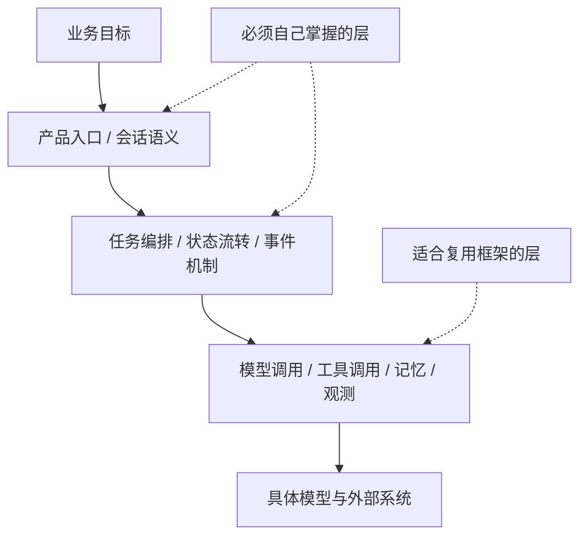
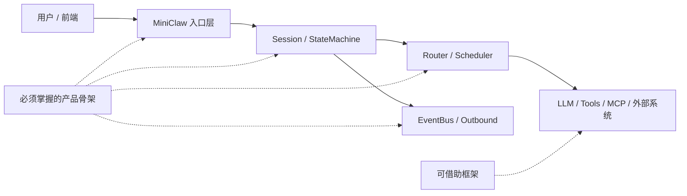

> **学习目标**：理解为什么在 LangChain、LangGraph、Spring AI 已经存在的情况下，这门课仍然选择手写 MiniClaw 的核心框架  
> **预计时长**：18 分钟  
> **难度**：入门

---

## 先说结论：我们不是为了“证明自己能造轮子”，而是为了拿回系统主权

只要你稍微搜一下 Agent 技术栈，很快就会看到一堆成熟名字：

- LangChain
- LangGraph
- Spring AI
- 各种智能体平台、工作流平台、低代码平台

所以一个非常合理的问题会立刻出现：

> 既然轮子这么多，为什么 MiniClaw 还要手写？

这个问题必须回答清楚。  
如果答不清楚，后面整门课都会变得很虚。

我的结论先摆在前面：

> MiniClaw 不是为了和这些框架对着干，而是为了让你在真正复杂的 Agent 系统里，不把最关键的中间层控制权交出去。

这里说的“控制权”不是一句空话，它至少包括：

- 任务入口怎么定义
- 会话状态怎么流动
- 工具边界在哪里
- 事件如何回传
- 长链路执行如何暂停、恢复、审计
- 哪一层依赖具体模型供应商，哪一层不依赖

如果这些问题你都只能通过框架默认行为来理解，那你最后拿到的不是一个系统，而是一套“能跑起来的配置”。

而课程真正要教的，不是配置框架，而是设计系统。

---

## 先承认现实：LangChain、LangGraph、Spring AI 都有真价值

要讲“为什么手写”，第一步不是批判框架，而是先承认它们为什么会流行。

### LangChain / LangGraph 解决了什么

LangChain 这一系的价值，最早在于把模型调用、prompt、工具、memory、retrieval 等常见组件统一进了一套开发体验里。  
而 LangGraph 在官方文档里进一步明确了自己的定位：它是一个 **low-level orchestration framework and runtime**，重点放在：

- durable execution
- long-running, stateful agents
- human-in-the-loop
- memory
- production-ready deployment

这说明 LangGraph 已经不只是“prompt 工具箱”，而是在认真解决 Agent 编排和运行时问题。

### Spring AI 解决了什么

Spring AI 的价值则很不一样。  
它更像是 Java / Spring 世界里的统一接入层。

官方文档强调它要做的是：

- 统一 `ChatModel` / `StreamingChatModel`
- 提供 `ChatClient`
- 支持 tool calling
- 提供 advisors、chat memory、observability
- 提供 MCP 相关支持

对于 Java 团队来说，这非常有吸引力。  
因为它让“接不同模型供应商、挂上工具、接进 Spring 体系”这件事变得非常顺手。

所以如果你只是想：

- 快速搭一个 demo
- 在现有业务系统里接入 LLM
- 做一个单 Agent 或轻量工具调用闭环
- 少写基础样板代码

这些框架完全合理，甚至应该优先考虑。

---

## 真正的问题不在“能不能用框架”，而在“你把哪一层交给了框架”

很多团队讨论这个问题时，经常把问题问错。

他们会问：

> 框架好不好？

这其实不是关键。

真正关键的问题是：

> 你愿意把系统的哪一层交给框架，哪一层必须自己拥有？

这是两件完全不同的事。

因为在 Agent 系统里，不同层的可替代性完全不同：

- 模型 SDK 这一层，通常很适合用框架抽象
- 工具适配这一层，经常也适合复用框架能力
- 观测、日志、重试、基础接线，很多也没必要重造

但有一些层，一旦完全交出去，代价会非常高：

- 任务生命周期
- 会话状态机
- 事件总线
- 中断 / 恢复机制
- 权限边界
- 面向业务的路由规则
- 跨供应商、跨运行时的协议适配

因为这些层不是“LLM 开发通用件”，而是你的产品和系统真正长出来的地方。

也就是说，Agent 框架争论的核心从来不该是：

> 用还是不用。

而应该是：

> 用到哪一层为止。

这张图就是这一节最核心的判断。

---

## 为什么很多 Agent 项目后面都会“回到自己写”

这是行业里一个非常常见的路径：

1. 先用框架把 demo 跑起来
2. 再不断补业务逻辑
3. 最后发现系统越来越难解释、越来越难改
4. 然后开始把关键链路一层层从框架里“抽出来自己写”

为什么会这样？

因为框架最擅长解决的是“通用问题”，而真实系统最终一定会长出“非通用问题”。

这些非通用问题包括：

- 我们的 session 到底是什么
- 任务失败后从哪里恢复
- 工具调用结果怎么变成内部事件
- 前端怎样实时订阅中间过程
- 哪些步骤需要人工确认
- 哪些工具有权限隔离
- 一个任务里到底允许多少自主性

这些问题表面上看像“功能细节”，本质上却决定了系统架构。

而一旦这些架构决策被埋在某个框架默认链路里，你就会开始遇到几个典型症状：

- 能跑，但很难解释
- 能扩，但扩一次就要绕开一层默认抽象
- 能调，但调试信息不对应你的业务边界
- 能换模型，但很难换运行时结构
- 能加工具，但加完后权限和状态语义开始混乱

也就是说，很多团队后面不是“突然喜欢造轮子”，而是：

> 当系统进入真实复杂度后，默认抽象已经不再贴合自己的问题空间。

---

## LangChain / LangGraph 的强项与边界

这部分要说具体一点。

LangGraph 官方自己就讲得很清楚：它是一个偏底层的 orchestration framework，核心能力是持久执行、状态化工作流、人机协同、记忆和部署。  
这恰好说明它已经意识到纯 prompt chain 的时代不够用了。

所以它的强项很明确：

- 很适合快速搭建 agent workflow
- 很适合把图式编排和长链路状态跑起来
- 很适合做实验、验证和生产观测
- 生态很大，资料很多

但它的边界也很明确：

- 它提供的是“通用 agent 编排模型”，不是你的产品语义
- 它有自己的状态图思维方式，而你的系统未必天然就是那种图
- 当你的核心价值在于会话、事件、实时推送、权限和业务协议时，图式编排不一定就是最顺手的抽象

换句话说，LangGraph 不是不够强，而是：

> 它强在“如何编排 agent”，不等于它天然等于“如何设计你的 Agent 产品”。

这两者有重叠，但不是一回事。

---

## Spring AI 的强项与边界

Spring AI 也一样。

如果你在 Java 世界里工作，它确实很舒服：

- `ChatClient` 很顺手
- tools 接入很自然
- advisors 可以把常见增强逻辑挂进去
- chat memory、observability、MCP 都有现成支持
- 对接 OpenAI、Anthropic、Vertex、Ollama 等模型供应商比较统一

这非常适合作为“模型与工具接入层”。

但问题在于，Spring AI 解决得最好的，其实还是：

- 模型访问抽象
- 工具调用抽象
- Spring 生态集成

它并不会自动替你定义：

- 你的 gateway 怎么和 agent runtime 解耦
- 你的 session registry 长什么样
- 你的 outbound event 怎么建模
- 多路客户端订阅和中间事件广播怎么设计
- 一次任务从 user intent 到内部状态变更的协议边界在哪里

这些问题一旦进入系统主线，你会发现：

> Spring AI 是很好的底层接入件，但它不是你的系统架构本身。

所以把它放在 MiniClaw 的上下文里，最合理的位置通常不是“整套系统都交给它”，而是：

> 把它当作模型与工具层的适配器，而不是产品运行时的唯一骨架。

---

## MiniClaw 为什么要自己掌握五层骨架

这时就能回到课程自己的立场了。

MiniClaw 之所以强调手写，不是因为框架不好，而是因为这门课真正要让你学会的是五层骨架：

1. 入口层
2. 会话与状态层
3. 路由与调度层
4. 执行与工具层
5. 事件与回传层

你会发现，这五层里真正可以放心借助框架的，主要是下面那一部分：

- 模型客户端
- 工具适配
- 观测能力
- 部分 memory 或 MCP 连接能力

而上面那几层恰恰是 MiniClaw 最想让你自己掌握的：

- 用户说一句话，系统如何生成一个可追踪任务
- 一个任务如何进入 session
- session 如何进入状态机
- 状态变化如何变成内部事件
- 事件如何路由到前端、工具层或其他子系统

这部分一旦不自己设计，你后面无论换模型、换框架、换协议，都会非常被动。

这也是为什么后面的课程会不断强调：

> 先定义系统边界，再决定哪里复用框架。

而不是反过来。

---

## 什么时候应该直接用框架，什么时候必须自己写

为了避免走向另一个极端，这里要给一个非常现实的判断标准。

### 适合直接用框架的时候

- 你在做验证型项目
- 你只需要单 Agent 或轻量 workflow
- 你的核心价值不在运行时，而在业务数据或上层体验
- 你的团队更缺业务交付速度，而不是系统主权
- 你短期内不会做复杂会话、事件流、权限分层和多端订阅

这时候，优先上框架通常是对的。

### 必须自己掌握中间层的时候

- 你要做长期演进的 Agent 平台
- 你需要精确控制 session、state、event、retry、resume
- 你需要让前端实时看到 agent 中间状态
- 你要跨模型供应商、跨运行时、跨工具协议长期演化
- 你要把 agent 行为嵌入现有业务系统，而不是停留在 demo

这时候，如果还把所有关键路径都交给框架，后面通常会付出更高代价。

可以把这个判断压缩成一句话：

> 框架适合帮你加速，系统骨架必须自己负责。

---

## 所以“重造轮子”真正重造的是什么

最后把这个标题里的误解拆掉。

MiniClaw 真正在“重造”的，并不是：

- HTTP 客户端
- 模型 SDK
- 向量库 SDK
- MCP 全套生态
- 每一个工具适配器

真正要重新拿回来的，是下面这些定义权：

- 什么是 session
- 什么是 task
- 什么是 internal event
- 什么是 state transition
- 什么是 outbound message
- 什么是 tool boundary
- 什么是 runtime contract

这才是一个 Agent 系统最不该外包的部分。

如果你把它们全交给框架，短期确实会更快；  
但从中长期看，你会越来越难回答一个根本问题：

> 这个系统到底是按谁的思路长出来的？

如果答案永远是“按框架默认思路”，那你很难真正成为系统的创造者。

而这门课想做的，正是把你从“会用现成平台的人”带到“能定义系统边界的人”。

---

## 这一节你应该记住什么

如果把这节压缩成四句话，我希望你记住的是：

1. LangChain、LangGraph、Spring AI 都有真价值，尤其适合快速验证、统一接入和复用通用能力。
2. 真正的问题不是“要不要用框架”，而是“你把哪一层交给框架”。
3. 模型调用、工具接入、观测这些层通常适合复用；会话、状态、事件、路由、权限这些系统骨架更应该自己掌握。
4. MiniClaw 选择手写，不是反框架，而是为了保留长期演进 Agent 系统所需的主权与解释力。

下一节我们会把这个抽象判断落到一张真正的系统图上，直接画出 MiniClaw 的五层架构全景。

---

## 参考资料

- LangChain, [LangGraph overview](https://docs.langchain.com/langgraph)
- Spring AI, [Introduction](https://docs.spring.io/spring-ai/reference/)
- Spring AI, [Chat Client API](https://docs.spring.io/spring-ai/reference/api/chatclient.html)
- Spring AI, [Tool Calling](https://docs.spring.io/spring-ai/reference/api/tools.html)
- Spring AI, [Advisors API](https://docs.spring.io/spring-ai/reference/api/advisors.html)
- Spring AI, [Chat Memory](https://docs.spring.io/spring-ai/reference/api/chat-memory.html)
- Spring AI, [Observability](https://docs.spring.io/spring-ai/reference/observability/)
- Spring AI, [MCP Annotations](https://docs.spring.io/spring-ai/reference/api/mcp/mcp-annotations-overview.html)
- OpenAI, [A practical guide to building agents](https://openai.com/business/guides-and-resources/a-practical-guide-to-building-ai-agents/)
