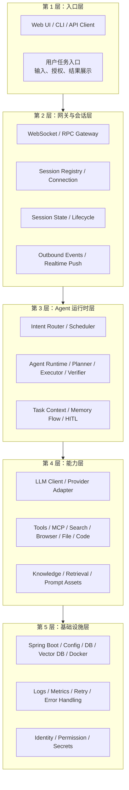
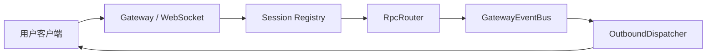
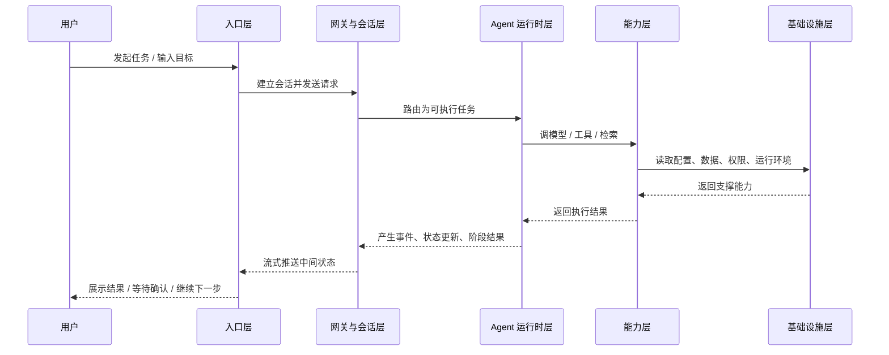
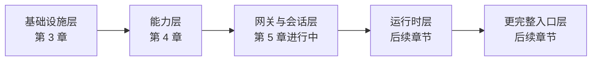

> **学习目标**：用一张全景图建立对 MiniClaw 的整体空间感，理解五层架构分别负责什么、为什么要分层、当前课程已经做到哪里  
> **预计时长**：16 分钟  
> **难度**：入门

---

## 先说结论：MiniClaw 不是一个“大脑”，而是一套分层协作系统

很多人第一次接触 Agent 系统时，脑子里会默认出现一种模糊图景：

> 用户发一句话，某个很聪明的大模型想一想，然后自己把事情都做完。

这个图景不能说完全错，但它会把真正重要的工程问题全部抹平。

现实里的 Agent 系统，几乎不可能只有一个“大脑”。  
它更像一条分层流水线：

- 最上面接住用户任务
- 中间把任务放进会话、状态和调度系统
- 再往下把任务拆给模型、工具和外部运行时
- 最下面由数据库、配置、消息和基础设施托住

MiniClaw 想做的，不是把这些复杂性藏起来，而是把它们拆成五层，让你能清楚回答：

- 任务从哪里进入
- 状态在哪里变化
- 谁负责决策，谁负责执行
- 工具和模型在哪一层接入
- 哪些能力属于产品骨架，哪些只是可替换部件

所以这一节的目标不是堆术语，而是先给你一张地图。

---

## 一张图先看懂 MiniClaw 的五层

如果只看一句话，可以把它记成：

> 入口层负责“接任务”，网关层负责“稳住连接与状态”，运行时层负责“把任务推进下去”，能力层负责“真正做事”，基础设施层负责“让这一切长期可运行”。

这五层一旦分开，后面每一章就不再像零碎功能，而会变成一块块有位置的系统部件。

---

## 第一层：入口层，负责“让人把任务交进来”

入口层最容易被低估，因为很多人会觉得：

> 不就是一个聊天框吗？

其实不是。

入口层真正负责的，是把人类的模糊目标变成一个可以被系统接住的任务入口。  
它不仅是 UI，更是一种产品语义：

- 用户如何发起任务
- 用户是否需要选择会话
- 用户能看到哪些中间状态
- 用户在什么地方授权、确认、打断
- 结果如何被呈现为可理解对象

为什么这一层必须单独看？

因为同样一个 Agent 内核，换不同入口，系统体验会完全不同：

- 放在聊天界面里，像“对话助手”
- 放在终端里，像“开发代理”
- 放在业务系统里，像“流程执行员”

所以入口层解决的不是技术接线，而是：

> 用户到底在把什么任务、以什么方式、委托给系统。

MiniClaw 后面虽然会重点讲后端，但这层必须在第一章先看清楚。  
否则你很容易把整个系统误解成“后端在自言自语”。

---

## 第二层：网关与会话层，负责“让任务进入一个可管理的实时系统”

这一层是 MiniClaw 当前课程里已经开始真正落地的部分。

第 5 章正在做的，本质上就是这一层：

- `GatewayWebSocketHandler`
- `RpcRouter`
- `InMemorySessionRegistry`
- `GatewayEventBus`
- `OutboundDispatcher`

这层的关键价值是把“一个用户请求”变成“一个可追踪、可推送、可约束的会话事件流”。

它负责的事情包括：

- 维持实时连接
- 维护 session 与 connection 的边界
- 统一 RPC 协议
- 接住 request / event / completed / error
- 把内部事件稳定地回推到客户端

为什么这层如此重要？

因为如果没有它，Agent 系统很容易退化成一堆散乱接口：

- 一个 HTTP 调模型
- 一个 HTTP 查状态
- 一个接口看日志
- 一个接口拿结果

这种结构做 demo 没问题，但做实时 Agent 会非常痛苦。

所以网关与会话层真正解决的是：

> 让系统拥有持续会话、实时反馈和明确边界，而不是一次性函数调用。

这其实就是第 5 章当前已经搭起来的主干。

---

## 第三层：Agent 运行时层，负责“真的把任务推进下去”

如果说网关层解决的是“任务如何进入系统”，那运行时层解决的就是：

> 任务进入系统之后，谁来决定下一步做什么？

这层通常是最容易被误解成“就是模型”的地方。  
其实它比模型大得多。

运行时层至少会包含这些责任：

- 意图路由
- 任务拆解
- Planner / Executor / Verifier 等角色协作
- memory 的读写时机
- human-in-the-loop 的确认点
- 失败后的重试、暂停和恢复

换句话说，运行时层不等于某个模型调用，而是：

> 一套围绕目标不断观察、决策、执行、反馈的任务推进机制。

为什么这一层要单独拿出来？

因为它才是 Agent 和普通“工具调用型聊天机器人”真正拉开差距的地方。

一个聊天机器人可能也会调工具；  
但一个真正的 Agent 运行时，必须能在多步链路里稳定推进任务，并且让每一步都还能被观察、控制和纠偏。

这也是为什么前面我们一直在讲状态、事件、会话和多 Agent 协作。  
那些东西最后都要汇进这里。

---

## 第四层：能力层，负责“让系统真的能做事”

这层已经有一部分在第 4 章实现了。

第 4 章手写的 `LlmClient`，就是能力层里最核心的一块：

- 统一请求与响应模型
- 同步与流式调用
- 多 provider 适配
- 多模态扩展
- 重试、退避、错误处理

但能力层不只有模型。

它还应该包括：

- 搜索能力
- 浏览器能力
- 文件系统能力
- 代码执行能力
- MCP 工具接入
- 知识检索与 prompt 资产

这层的特点是：它很重要，但它不应该成为系统骨架。

为什么？

因为能力层本质上是“可替换部件”的集合：

- 模型可以换
- 工具可以增删
- provider 可以切换
- 检索方案可以升级

如果你把整个 Agent 系统都建立在某个单一能力之上，那么一旦能力栈变了，系统边界也会跟着塌。

所以 MiniClaw 的设计原则是：

> 能力层很强，但它应该被运行时层调度，而不是反过来统治整个系统。

---

## 第五层：基础设施层，负责“让前面四层长期活着”

这层听起来最不性感，却最接近真实工程。

第 3 章做的环境、Docker Compose、Flyway、Spring Boot 骨架、配置管理，其实就是在搭这层。  
而第 4 章里的错误处理、重试、退避、观测，又给这层补上了运行质量。

基础设施层一般包括：

- 配置系统
- 数据库与向量库
- 容器与部署环境
- 日志、指标、追踪
- 权限、密钥与安全边界
- 任务运行所需的底座服务

为什么这一层必须画进总图？

因为很多人在学 Agent 时会出现一种危险错觉：

> 只要 prompt 和模型足够好，系统自然就能跑起来。

现实恰恰相反。

真正把系统拖垮的，往往不是“模型不够聪明”，而是：

- 配置乱了
- 密钥管不好
- 重试策略没有
- 状态无法恢复
- 出错后没有观测
- 环境不一致

所以基础设施层虽然不直接“思考”，却决定了前面四层到底是不是工程系统，而不只是一次性演示。

---

## 再看一次：一个用户请求如何穿过这五层

只看分层图还不够，我们再看一遍任务流。

如果你以后对某个 Agent 系统感到“说不清楚它到底是怎么工作的”，就把它强行塞进这张图里。  
塞不进去的地方，通常就是它的架构边界不清楚的地方。

---

## 课程进度现在走到哪一层了

这点也要明确，不然全景图很容易让人误会成“所有层都已经做完”。

按当前课程进度，MiniClaw 大致处在这里：

- **基础设施层**：第 3 章已完成
- **能力层中的 LLM Client**：第 4 章已完成
- **网关与会话层**：第 5 章已实现到 event bus / outbound dispatcher
- **运行时层**：还在后续章节逐步展开
- **更丰富的入口层**：会随着后续交互形态一起完善

可以把当前进度画成这样：

这张图的意思不是“先后顺序绝对固定”，而是帮助你看到：

> 课程在按系统骨架从下往上、从基础能力到运行时主线，一层层往前搭。

---

## 为什么五层架构比“大一统 Agent”更适合教学，也更适合长期演进

到这里可以把这张全景图的真正价值说透了。

为什么我们不用一种更“酷”的讲法，比如：

- 超级 Agent
- 全自动数字员工
- 一个统一智能内核

因为这种讲法虽然传播强，但工程上很危险。

它会让你忽略三个关键事实：

1. **不同问题属于不同层**
   WebSocket、session、memory、tool calling、retry、permission，根本不是一类问题。

2. **不同层的演化速度不同**
   模型和工具层变化极快，但 session、event、protocol 这类边界反而应该尽量稳定。

3. **真正能复用的是边界，不是热点名词**
   今天流行的是浏览器 Agent，明天可能流行的是 A2A 协作；  
   但只要五层骨架清楚，系统依然能演进。

所以五层架构的价值，不只是“看起来整齐”，而是：

> 它让你知道什么该稳定、什么该替换、什么该自己掌握、什么可以借外部生态。

这就是 MiniClaw 这门课真正要给你的系统感。

---

## 这一节你应该记住什么

如果把这节压成四句话，我希望你记住的是：

1. MiniClaw 不是一个“大模型黑盒”，而是一套由入口层、网关会话层、运行时层、能力层、基础设施层组成的五层系统。
2. 第 5 章当前实现的主干，主要位于“网关与会话层”；第 4 章实现的是“能力层”里的 LLM Client；第 3 章实现的是基础设施层。
3. 真正决定 Agent 长期可演进性的，不是某个单点能力，而是这些层之间的边界是否清楚。
4. 只要你能把一个系统放回这五层图里，你就比大多数“只会追热点 Agent 名词”的讨论更接近工程现实。

下一节我们会进一步把这张全景图转成一条演进路线，回答 MiniClaw 怎么从 MVP 一步步长到企业级。

---

## 参考资料

- [第 3 章：MiniClaw 的开发环境与基础底座](/courses/miniclaw/chapter-03)
- [第 4 章：从零手写 LLM 客户端](/courses/miniclaw/chapter-04)
- [第 5 章：WebSocket 网关与 RPC 协议](/courses/miniclaw/chapter-05)
- OpenAI, [A practical guide to building agents](https://openai.com/business/guides-and-resources/a-practical-guide-to-building-ai-agents/)
- Anthropic, [Building effective agents](https://www.anthropic.com/engineering/building-effective-agents)
