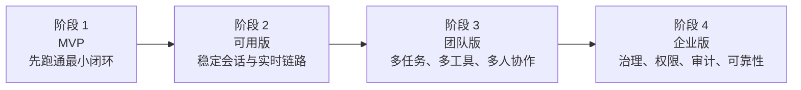
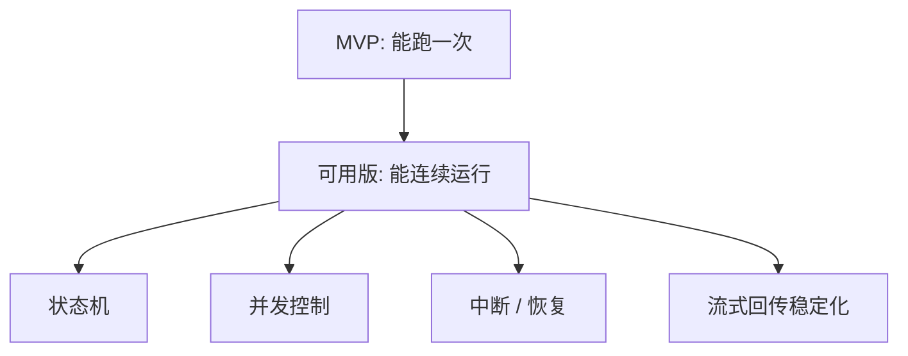
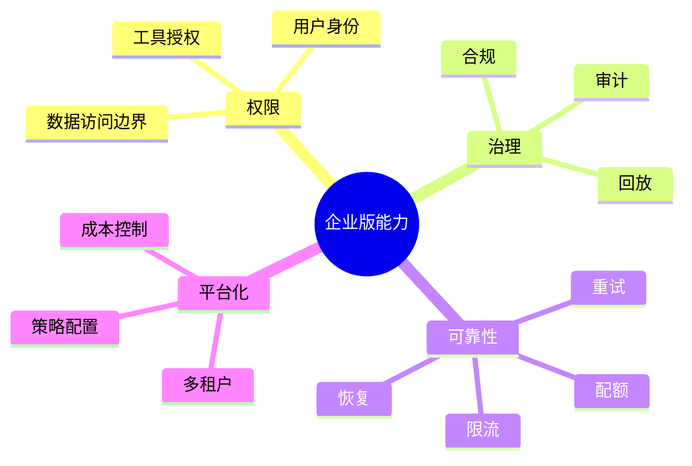
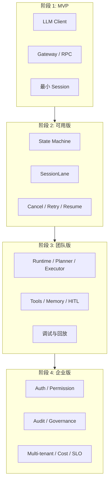

> **学习目标**：理解 MiniClaw 不该一上来就追求“企业级全能”，而应该按阶段演进；看懂从 MVP 到企业级每一步到底增加了什么复杂度  
> **预计时长**：15 分钟  
> **难度**：入门

---

## 先说结论：企业级不是“多做一点功能”，而是系统复杂度跨了好几个台阶

很多人做 Agent 项目时，最常见的误区是这样的：

1. 先做出一个能聊天的 demo
2. 然后不断往上加功能
3. 最后希望它“自然长成企业级”

这条路通常会失败。

因为企业级不是“功能更多一点”，而是系统面对的问题发生了质变：

- 从单次调用，变成长链路任务
- 从单用户演示，变成多用户并发
- 从一次执行成功，变成失败后也要恢复
- 从默认可信环境，变成权限、审计、合规都要可控
- 从“今天能跑”，变成“下个月还能持续演进”

所以 MiniClaw 的全局规划不是一张功能 wishlist，而是一条复杂度演进路线。

这条路线的核心思想只有一句话：

> 先做出边界清晰的最小闭环，再在不打穿边界的前提下，一层层加能力。

---

## 先看全局：MiniClaw 的四阶段演进

这四个阶段不是“版本号”，而是四种完全不同的系统目标。

你如果把后面阶段的问题，提前塞进前面阶段，项目会很快失控。  
反过来，如果你永远停在前面阶段，系统又永远只能演示，不能落地。

所以这节的重点，就是看清每个阶段该解决什么，不该急着解决什么。

---

## 阶段 1：MVP，目标不是强，而是先形成一条最小闭环

MVP 阶段最容易被误解。

很多人以为 MVP 的意思是“随便拼个 demo 先看效果”。  
但对 MiniClaw 这种系统来说，真正的 MVP 不是草率，而是克制。

它至少要满足一件事：

> 用户发出一个任务，系统能稳定接住、执行、回传结果，并且你知道中间每一层都在做什么。

这个阶段最重要的能力通常只有这些：

- 基础环境和配置能稳定启动
- 有统一的模型调用客户端
- 有一个统一入口能接住任务
- 有最基本的 session 概念
- 有最基本的 request / event / completed / error 协议
- 可以把一次任务完整跑通

你会发现，这其实正对应课程当前已经完成和正在进行的部分：

- 第 3 章：基础设施底座
- 第 4 章：LLM Client
- 第 5 章前半：Gateway / RPC / EventBus

MVP 阶段**不应该**急着做的事情包括：

- 复杂多 Agent 协作
- 长期记忆持久化
- 企业权限体系
- 多租户隔离
- 审计报表和运维平台

不是这些不重要，而是：

> 如果最小主链路都还不稳，越早加这些，越像在松土上盖楼。

---

## 阶段 2：可用版，目标是让系统开始“连续工作”

MVP 跑通之后，真正的下一步不是继续加新功能，而是先让系统从“演示一次”变成“持续可用”。

这时候重点会从“有没有”转向“稳不稳”。

MiniClaw 在这个阶段通常要补的能力包括：

- 更完整的 session state machine
- 同 session 下的并发控制
- 更稳定的流式事件回传
- 初步的任务恢复、超时、取消
- 更明确的工具边界
- 更清晰的运行时状态观测

这也是为什么 `SessionStateMachine`、`SessionLane`、`chat.send` 端到端主链路会成为第 5 章后半的自然重点。

这个阶段的本质变化是：

> 系统开始从“能回答”过渡到“能连续处理任务而不乱”。

很多 Agent 产品其实就死在这里。

表面看它们模型很强、UI 很炫，但只要：

- 两个请求同时进来
- 一个任务执行到一半断了
- 中间事件顺序错了
- 前端状态和后端状态对不上

整个系统就会显得非常脆弱。

所以“可用版”的真正门槛，不是多一个功能，而是：

> 会话、状态、事件和并发开始形成可靠秩序。

---

## 阶段 3：团队版，目标是让系统开始承载真实工作流

当系统进入团队使用阶段，复杂度又会再跳一次。

这时问题不再只是“一个任务能不能跑”，而会变成：

- 多个用户能不能同时使用
- 不同任务能不能共享能力但不互相污染
- 工具调用有没有权限和角色边界
- 一个任务能不能拆成多步、多角色、多工具协同
- 团队成员能不能理解系统中间过程

这个阶段，MiniClaw 往往会逐步需要：

- 更成熟的 Agent runtime
- 更清楚的 planner / executor / verifier 分工
- 多工具协作与结果归并
- 初步的 memory 设计
- 人工确认节点
- 更好的日志、回放和调试能力

也就是说，这时候系统开始真正接近“工作系统”，而不再只是“模型外壳”。

团队版阶段最重要的不是把所有能力都自动化，而是让系统具备：

- 可协作
- 可解释
- 可排障
- 可演进

这时你会发现，前面第一章一直在强调的那些概念都会重新出现：

- 多 Agent 为什么有价值
- 为什么需要事件边界
- 为什么框架不能替你定义产品骨架

因为一旦进入团队使用，所有这些问题都会从“理论”变成“工程压力”。

---

## 阶段 4：企业版，目标是让系统进入治理与责任世界

到了企业版，系统面对的核心问题又变了。

这时最重要的往往不是“再聪明一点”，而是“再可控一点”。

企业真正关心的事情通常是：

- 谁可以调用什么能力
- 哪些任务需要审批
- 哪些数据可以被访问
- 任务执行过程是否可审计
- 失败后能不能追责和回放
- 模型、工具、知识源是否可替换
- 系统是否支持多租户、隔离和配额

所以企业版通常意味着以下能力开始变成刚需：

- 身份与权限体系
- 工具级和数据级授权
- 审计日志与回放
- 配额、限流、成本控制
- 多租户隔离
- 更强的可观测性与 SLO
- 灰度发布、策略配置、运行治理

到了这一步，你会发现 Agent 系统已经很像一个真正的平台，而不再只是一个智能功能。

这也是为什么很多“AI Agent demo 公司”最后做不成企业产品。  
不是因为模型不够强，而是因为治理成本被严重低估了。

---

## 这四个阶段和 MiniClaw 五层架构是什么关系

如果把上一节的五层架构和这节的四阶段路线叠在一起，会看得更清楚。

不同阶段，并不是在“新建不同系统”，而是在同一套五层骨架上逐步补齐不同层的成熟度：

- **MVP**
  先把基础设施层、能力层、网关层的主链路打通
- **可用版**
  把网关层和运行时层做稳，补齐状态、并发和恢复
- **团队版**
  强化运行时层和能力层的协同，开始处理多人、多任务、多工具
- **企业版**
  让五层都具备治理能力，尤其补强权限、审计、可观测与平台化能力

也就是说，系统不是“越做越厚”，而是：

> 同一套骨架在不同阶段被赋予不同成熟度。

这点非常重要。

因为它意味着你不应该每到一个新阶段就推翻前一阶段，而应该从一开始就把边界设计对。

---

## 课程路线为什么也要按这个节奏展开

这门课的教学顺序，本质上就是这条演进路线的工程化拆解。

它不是先讲一堆“前沿概念”，再给你一个终极大成品。  
它是在按阶段带你搭：

1. 第 3 章先把底座搭稳
2. 第 4 章先把能力层里最核心的 LLM Client 写清楚
3. 第 5 章把实时入口和会话主链路搭起来
4. 后续章节再补状态机、并发、chat.send 主链路、运行时、工具、记忆和治理

这条路线背后的判断是很现实的：

> 任何一个真正能长成企业级的 Agent 系统，都必须先经过“能跑”“能稳”“能协作”“能治理”这几个阶段。

如果你跳过中间某一层，系统迟早会回来补课。

所以 MiniClaw 的课程路线，不只是“按知识点排顺序”，而是在模拟真实系统的成长逻辑。

---

## 一张图看懂从 MVP 到企业级到底加了什么

如果你以后在做项目时想判断“现在到底该做什么”，可以先问自己：

- 我现在是在补最小闭环，还是在补可用性？
- 我现在是在做团队协作能力，还是已经进入治理问题？

这个判断会直接决定你该写什么代码、该不该上某个框架、该不该引入数据库、该不该先做权限系统。

---

## 这一节你应该记住什么

如果把这节压成四句话，我希望你记住的是：

1. 企业级 Agent 系统不是“功能更多一点的 demo”，而是复杂度经历了多次台阶式跃迁。
2. MiniClaw 的合理路线是四阶段：MVP、可用版、团队版、企业版。
3. 每个阶段解决的问题完全不同，不能把后期治理问题过早塞进前期主链路。
4. 课程本身的章节顺序，就是在按真实系统成长逻辑，一层层带你走完这条路。

下一节我们会把视角再拉回“学习者自己”，给出这门课的学习路线图：怎么从使用者一步步走向创造者。

---

## 参考资料

- [1.9 MiniClaw 五层架构全景图](/courses/miniclaw/chapter-01/miniclaw-five-layer-architecture)
- [第 3 章：MiniClaw 的开发环境与基础底座](/courses/miniclaw/chapter-03)
- [第 4 章：从零手写 LLM 客户端](/courses/miniclaw/chapter-04)
- [第 5 章：WebSocket 网关与 RPC 协议](/courses/miniclaw/chapter-05)
- OpenAI, [A practical guide to building agents](https://openai.com/business/guides-and-resources/a-practical-guide-to-building-ai-agents/)
- Anthropic, [Building effective agents](https://www.anthropic.com/engineering/building-effective-agents)
