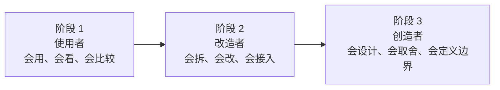
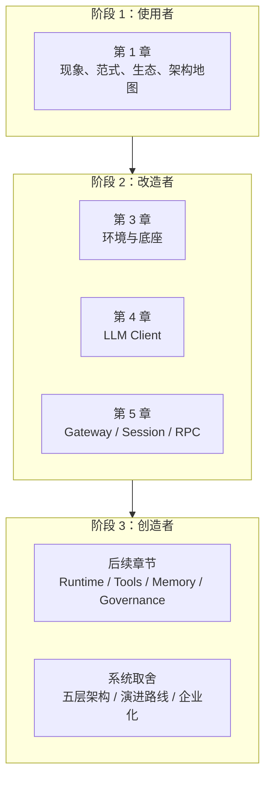

> **学习目标**：看清这门课不是只教你“把功能做出来”，而是带你经历一次能力结构升级；明确自己当前处在哪一阶段、下一步该补什么  
> **预计时长**：12 分钟  
> **难度**：入门

---

## 先说结论：学 Agent 最难的，不是技术栈，而是身份转换

很多人学 AI Agent 时，容易把目标定得太窄。

他们会说：

- 我想会用几个 Agent 产品
- 我想接一个模型 API
- 我想跑通一个开源项目
- 我想搭一个自己的 demo

这些都没错，但它们还不是真正的终点。

因为如果你一直停在这个层面，你很可能会长期处在一种尴尬状态：

- 产品会用，但解释不清为什么这么设计
- 框架会调，但不知道边界该怎么定
- demo 会跑，但系统一复杂就容易失控
- 热点知道很多，但没有自己的工程判断

所以这门课真正想完成的，不只是“教会你做点东西”，而是带你完成一次身份转换：

> 从使用者，变成改造者，再变成创造者。

这三个阶段，看起来像学习进度，实际上代表三种完全不同的能力结构。

---

## 一张图先看懂这门课的三阶段目标

这张图里最重要的不是顺序，而是：

- 每一阶段解决的问题不同
- 需要建立的判断力不同
- 常见卡点也完全不同

很多人之所以学了很久还觉得自己“没真正掌握”，往往不是因为不努力，而是因为一直在用第一阶段的方法，试图解决第三阶段的问题。

---

## 第一阶段：使用者，目标是建立正确认知，而不是盲目追热点

“使用者”听起来像很初级，但其实这是一个必须认真走过的阶段。

因为在今天这个 Agent 爆炸式变化的环境里，最大的风险不是学得太少，而是先学乱了。

使用者阶段最重要的，不是马上写很多代码，而是先建立四种基本判断：

1. **能区分现象和本质**
   你能看懂 OpenClaw、Moltbook、Operator 这些现象背后到底在说明什么。
2. **能区分产品概念和系统结构**
   你知道“会聊天”“会调工具”“能执行任务”不是同一层事情。
3. **能区分热点叙事和真实能力边界**
   你不会把一次 viral demo 自动等同于成熟系统。
4. **能区分不同厂商在争什么**
   你知道 OpenAI、Anthropic、Google、国内厂商并不是在抢同一个位置。

这其实就是为什么第 1 章要先从现象、范式、历史、生态、架构全景讲起。

因为如果这一步没走稳，后面你一写代码，就很容易出现两个问题：

- 要么一上来就想做“全自动数字员工”
- 要么把 Agent 误解成“Prompt + Tool Calling”

使用者阶段真正的毕业标准不是“我看懂了很多名词”，而是：

> 面对一个新 Agent 产品或新框架，你已经能自己判断它到底解决了什么、没解决什么。

---

## 第二阶段：改造者，目标是从“会用现成能力”走到“能接进自己的系统”

当你进入第二阶段，学习目标就变了。

这时你不再满足于：

- 会用 ChatGPT
- 会配 LangChain
- 会跑一个现成仓库

你开始关心的是：

- 模型 API 怎么接
- 流式输出怎么做
- 错误和重试怎么处理
- WebSocket Gateway 怎么搭
- request、event、completed、error 这些边界为什么要这么设计
- session 和 connection 为什么不能混在一起

也就是说，第二阶段的本质是：

> 你开始学会把“别人的 AI 能力”改造成“自己系统的一部分”。

这也是 MiniClaw 第 3、4、5 章的主要目标。

在这个阶段，学习重点通常包括：

- 环境与工程底座
- LLM Client
- Gateway 与 RPC 协议
- session、event、state 这些系统边界
- 从一个可运行 demo 走向一个可维护骨架

这个阶段的典型标志是：你已经不再把 AI 当作一个黑盒服务，而开始把它当作一个要嵌入系统、要承担可靠性的工程组件。

改造者阶段真正的毕业标准不是“写了多少功能”，而是：

> 你已经能读懂、接入、改造一条真实的 Agent 主链路。

---

## 第三阶段：创造者，目标是定义自己的系统边界

第三阶段才是这门课真正想把你带到的位置。

走到这里，你要解决的问题已经不是“这个功能怎么接”，而是：

- 系统为什么要分层
- 哪些边界必须稳定
- 哪些地方该借框架，哪些地方必须自己掌握
- 运行时该怎么设计
- 状态、事件、权限、工具、memory 该怎样组合
- MVP 和企业级之间到底该怎样演进

换句话说，第三阶段的本质是：

> 你开始不再依赖别人替你定义系统，而能自己决定系统该长成什么样。

这时候你会发现，真正稀缺的已经不是某个具体 API 的用法，而是：

- 架构取舍能力
- 边界定义能力
- 复杂度管理能力
- 识别伪需求和阶段错配的能力

这也是为什么第一章后半会讲：

- 为什么多 Agent 不一定更好
- 为什么框架不能替你定义产品骨架
- 为什么要用五层架构理解 MiniClaw
- 为什么系统必须按 MVP 到企业级逐步演进

因为这些问题，本质上都属于“创造者”阶段的问题。

创造者阶段真正的毕业标准不是“我也能搭一个 demo”，而是：

> 你已经能从零定义一套 Agent 系统的主线、边界和演进方向。

---

## 这三阶段分别最容易卡在哪里

很多人学到一半会怀疑自己“是不是不适合做 Agent”，其实大多数时候不是能力问题，而是卡点没有被识别出来。

### 使用者阶段的常见卡点

- 热点看太多，认知反而更混乱
- 把概念口号当成工程事实
- 只会比较模型分数，不会看系统结构

### 改造者阶段的常见卡点

- 会调框架，但不会定位问题
- 会接 API，但不会定义协议和边界
- demo 能跑，一到流式和实时链路就乱

### 创造者阶段的常见卡点

- 总想一步做到企业级
- 容易高估多 Agent 和自动化范围
- 容易把系统设计变成功能堆砌

这三类卡点，对应的解决方式完全不同。

所以你学这门课时，很重要的一件事不是“我会不会”，而是：

> 我现在到底卡在第几阶段的问题上？

一旦这个问题能回答出来，很多焦虑会立刻消掉一半。

---

## 课程章节是怎么对应这三阶段的

如果把整个课程按学习者成长来重新看，会很清楚。

你会发现，这门课不是在随便排章节，而是在有意识地带你跨越三次能力跃迁：

- 第 1 章先纠正认知
- 第 3 到 5 章开始让你真正动手接系统
- 后续章节再逐渐把你推进到架构设计与系统创造

这也是为什么第 2 章目前没有出现在主线里。  
课程并不是在按“传统教材顺序”凑数字，而是在按能力成长路径排布。

---

## 怎样判断自己是否已经从“使用者”进入“改造者”

这里给一个很实用的判断标准。

如果你目前仍然主要在做下面这些事：

- 比较不同模型谁更强
- 看各种 Agent 产品演示
- 用平台配置工作流
- 跑别人的 demo

那你大概率还在第一阶段。

如果你已经开始能做这些事：

- 自己接模型 API
- 自己处理流式响应
- 自己定义前后端协议
- 自己设计 session / event / state 的边界

那你已经进入第二阶段。

再往上，如果你已经能独立回答这些问题：

- 为什么这套系统要这样分层
- 为什么这里用单 Agent，那里用多 Agent
- 为什么这个阶段不应该先做数据库或多租户
- 为什么这里该手写，那里该复用框架

那你就在向第三阶段靠近了。

这个判断的价值在于，它能让你少走很多弯路。  
因为你会知道，自己下一步该补的是“认知”“工程能力”，还是“架构判断”。

---

## 这门课真正想交付给你的，不是一堆知识点，而是一种系统身份

到最后，我们可以把这节最核心的话说得更直白一点。

MiniClaw 这门课真正想交付给你的，不是：

- 会几个 SDK
- 会几个框架
- 会几个产品操作

而是三种更稀缺的东西：

- 你对 Agent 的判断力
- 你把 AI 能力接入真实系统的工程能力
- 你设计和演进一套 Agent 系统的主导能力

这三者叠加起来，才对应“从使用者到创造者”的真正含义。

也就是说，这门课最终不是想让你成为：

> 一个很会追 Agent 热点的人。

而是想让你成为：

> 一个有能力定义、改造和创造 Agent 系统的人。

---

## 这一节你应该记住什么

如果把这节压成四句话，我希望你记住的是：

1. 学 Agent 最难的不是单个技术点，而是从“会用工具”走向“会定义系统”的身份转换。
2. 这门课对应三阶段成长：使用者、改造者、创造者。
3. 第 1 章主要帮助你建立判断力，第 3 到 5 章开始训练你接入和改造系统，后续章节再推进到真正的系统设计。
4. 你真正要追求的，不是多会几个平台，而是拥有独立理解、改造和创造 Agent 系统的能力。

到这里，第 1 章就完成了。  
接下来进入后续章节时，你不再只是“开始写代码”，而是带着一整套系统地图和成长路线进入实现阶段。

---

## 参考资料

- [第 1 章：AI Agent 现象、范式与系统全景](/courses/miniclaw/chapter-01)
- [1.9 MiniClaw 五层架构全景图](/courses/miniclaw/chapter-01/miniclaw-five-layer-architecture)
- [1.10 MiniClaw 全局规划：从 MVP 到企业级的演进路线](/courses/miniclaw/chapter-01/miniclaw-roadmap)
- [第 3 章：MiniClaw 的开发环境与基础底座](/courses/miniclaw/chapter-03)
- [第 4 章：从零手写 LLM 客户端](/courses/miniclaw/chapter-04)
- [第 5 章：WebSocket 网关与 RPC 协议](/courses/miniclaw/chapter-05)
